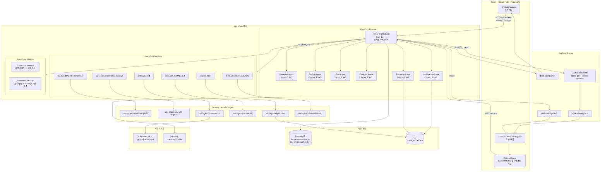
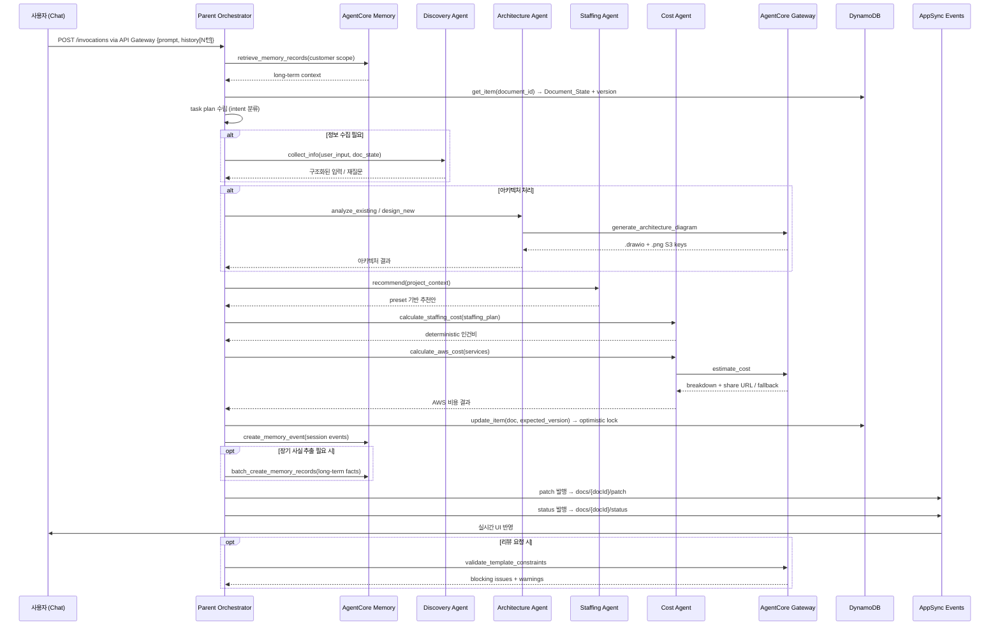
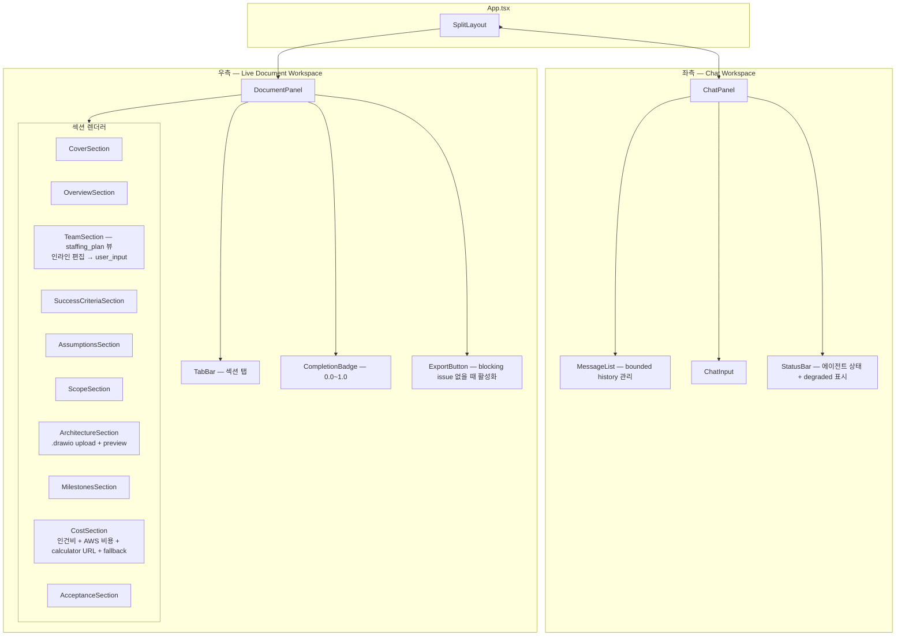

# Design Document — AgentCore 멀티에이전트 문서 생성 시스템 v2

## Overview

v2는 v1의 단일 Lambda + 직접 Bedrock 호출 아키텍처를 AgentCore Runtime/Memory/Gateway 기반 멀티에이전트 시스템으로 업그레이드한다. 기존 인프라(DynamoDB, S3, CloudFront, AppSync Events, API Gateway)는 유지하면서 AgentCore 계층을 추가한다.

핵심 변경 사항:

| 영역 | v1 | v2 |
|------|----|----|
| 에이전트 실행 | Lambda 내 인라인 `bedrock.invoke_model()` | AgentCore Runtime + `strands-agents` `@app.entrypoint` |
| 메모리 | `agent/lib/memory/memory.py` in-memory placeholder | `boto3 bedrock-agentcore` Memory API (short-term + long-term) |
| 도구 호출 | `agent/app/cost/gateway_client.py` stub | AgentCore Gateway 공통 클라이언트 (`agent/lib/gateway/agentcore_gateway.py`) — Lambda를 MCP 도구로 노출 |
| 에이전트 구조 | `handler.py` 내 `_invoke_bedrock()` 단일 호출 | Parent + 6 sub-agent hub-and-spoke |
| 동시성 | `VersionConflictError` 정의만 존재, 미적용 | DynamoDB optimistic locking 실제 적용 |
| 대화 이력 | 프런트에서 전체 history 전송 | bounded N턴 + AgentCore Memory 보충 |
| 비용 계산 | inline preset 기반 단순 계산 | deterministic staffing + Calculator MCP + fallback card + document-local summary |

설계 결정 근거:
- **AgentCore Runtime direct code deployment**: `bedrock-agentcore` SDK의 `BedrockAgentCoreApp` + `@app.entrypoint`로 ZIP 패키징 배포. 컨테이너 빌드 불필요
- **Sub-agents as logical agents**: 초기에는 Parent Runtime 내부 함수 호출로 구현. 독립 Runtime 분리는 필요 시 후속 작업
- **staffing_plan은 top-level**: v1 코드(`document_state.py`)에서 이미 `sections` 외부에 위치. Team UI 탭은 `staffing_plan`의 뷰이며, `stakeholders` 섹션은 연락처/조직 정보 전용
- **Bounded conversation history**: 프런트가 최근 N턴만 API에 포함, 전체 이력은 문서/세션 기준 별도 저장, AgentCore Memory가 long-term context 보충
- **Optimistic locking 실체화**: v1의 `DocumentStore.update()` 내 version 검증 로직을 Lambda/Runtime 레벨에서 실제 적용

## Architecture

### 전체 시스템 아키텍처



프런트엔드의 기본 진입점은 API Gateway이며, `POST /invocations` 요청은 API Gateway를 통해 Parent Orchestrator의 AgentCore Runtime invoke로 라우팅된다.

### 배포 아키텍처 — Terraform + Python CDK 분리

| 계층 | 도구 | 리소스 |
|------|------|--------|
| **기반 인프라** | Terraform (`infra/terraform/`) | IAM, S3, DynamoDB, Lambda (OnPublish + Gateway target 6개), API Gateway, AppSync Events, CloudFront |
| **AgentCore 계층** | Python CDK (`infra/cdk/deploy.py`) | AgentCore Runtime, Endpoint, Gateway, Gateway target 등록, Memory 생성 |
| **프런트엔드** | npm (`front/`) | Vite build → S3 + CloudFront |

배포 명령 (최대 2+1):
1. `AWS_PROFILE=mzadmin terraform -chdir=infra/terraform apply`
2. `AWS_PROFILE=mzadmin python infra/cdk/deploy.py --env demo`
3. `cd front && npm run build && npm run deploy` (선택)

### 에이전트 간 통신 패턴 — Hub-and-Spoke



위임 방식:
- Parent → Sub-agent: Runtime 내부 함수 호출 (logical agent). 각 sub-agent는 `strands.Agent()` 인스턴스로 별도 model_id와 system prompt 보유
- Parent → Gateway 도구: 공통 Gateway 클라이언트 (`agent/lib/gateway/agentcore_gateway.py`) 경유. Cost/Architecture/Formatter/Parent 모두 동일 클라이언트 사용
- Sub-agent 간 직접 통신 없음. 모든 조율은 Parent 경유


## Components and Interfaces

### 1. Parent Orchestrator (`agent/app/parent/orchestrator.py`)

AgentCore Runtime 위에서 동작하는 최상위 에이전트. `BedrockAgentCoreApp` + `@app.entrypoint`로 배포된다.

**Runtime 진입점:**
```python
from bedrock_agentcore import BedrockAgentCoreApp
from strands import Agent

app = BedrockAgentCoreApp()

PARENT_MODEL = "global.anthropic.claude-opus-4-6-v1"
CHILD_MODEL = "apac.anthropic.claude-3-5-sonnet-20241022-v2:0"

parent_agent = Agent(
    model_id=PARENT_MODEL,
    system_prompt=PARENT_SYSTEM_PROMPT,
    tools=[...],  # Gateway tools + sub-agent delegation tools
)

@app.entrypoint
def invoke(payload: dict) -> dict:
    """AgentCore Runtime 진입점. /invocations POST로 호출."""
    doc_id = payload["doc_id"]
    user_message = payload["prompt"]
    history = payload.get("history", [])  # bounded N턴
    # 1. Memory에서 long-term context 조회
    # 2. DynamoDB에서 Document_State + version 조회
    # 3. task plan 수립 → sub-agent 위임
    # 4. patch 생성 → optimistic lock으로 DynamoDB 갱신
    # 5. AppSync Events로 patch/status/chat 발행
    # 6. Memory에 세션 이벤트 저장
    return {"result": chat_response, "version": new_version, "status": "ok"}
```

문서 상태 변경의 authoritative UI 반영 경로는 AppSync `docs/{docId}/patch` 채널이며, `/invocations` HTTP 응답은 채팅 응답과 메타데이터만 반환한다.

**핵심 인터페이스:**
```python
class ParentOrchestrator:
    async def handle_message(self, doc_id: str, user_message: str, history: list[dict]) -> TaskPlan:
        """사용자 메시지 → task plan → 위임 → patch → 응답"""

    async def delegate_task(self, agent_name: str, task: Task, doc_state: DocumentState) -> AgentResult:
        """하위 에이전트에 작업 위임 (Runtime 내부 함수 호출)"""

    async def apply_patches(self, doc_id: str, patches: list[Patch], expected_version: int) -> int:
        """DynamoDB optimistic lock 적용 후 patch 발행. 새 version 반환"""

    async def publish_patch(self, doc_id: str, patches: list[Patch]) -> None:
        """AppSync Events docs/{docId}/patch 채널로 발행"""

    async def publish_status(self, doc_id: str, status: AgentStatus) -> None:
        """docs/{docId}/status 채널로 처리 상태 발행"""
```

**상태 전이:**
```
IDLE → PLANNING → DELEGATING → PATCHING → RESPONDING → IDLE
```

**Inference Profile Fallback:**
- Primary: `global.anthropic.claude-opus-4-6-v1`
- Fallback: 문서화된 대체 profile 또는 degraded mode (사용자에게 상태 메시지 표시)
- Sub-agent fallback: `apac.anthropic.claude-3-5-sonnet-20241022-v2:0` 실패 시 동일 패턴

모델 ID 및 inference profile은 기본값을 제공하되, 환경변수 또는 설정 레이어를 통해 override 가능하도록 구성한다.

### 2. Discovery Agent (`agent/app/discovery/`)

프로젝트 정보 수집 및 구조화. draft-required inputs와 export-required inputs를 구분한다.

```python
class DiscoveryAgent:
    def __init__(self):
        self.agent = Agent(model_id=CHILD_MODEL, system_prompt=DISCOVERY_PROMPT)

    async def collect_info(self, user_input: str, doc_state: DocumentState) -> DiscoveryResult:
        """입력 분석 → 누락 항목 판별 → 구조화 또는 재질문 생성"""

    def classify_missing_fields(self, doc_state: DocumentState) -> MissingFields:
        """draft-required vs export-required 분류"""
```

**draft-required inputs** (초안 생성에 필수): 고객사명, 프로젝트 목표, 대략적 범위, 아키텍처 유무
**export-required inputs** (DOCX export에 필수): Sponsor, Stakeholder, Team 상세, phase별 일정, 비용/리소스 정보

### 3. Architecture Agent (`agent/app/architecture/`)

이중 진입 모드에 따라 분석 또는 설계 보조를 수행한다.

```python
class ArchitectureAgent:
    def __init__(self):
        self.agent = Agent(model_id=CHILD_MODEL, system_prompt=ARCHITECTURE_PROMPT)

    async def analyze_existing(self, drawio_content: str, doc_state: DocumentState) -> ArchitectureResult:
        """기존 .drawio 파싱 → AWS 서비스 추출 → 해석/보완 → S3 저장"""

    async def design_new(self, project_context: ProjectContext, doc_state: DocumentState) -> ArchitectureResult:
        """프로젝트 요구사항 → AWS 아키텍처 초안 생성"""

    async def generate_diagram(self, architecture: ArchitectureResult, gateway_client: AgentCoreGatewayClient) -> DiagramArtifacts:
        """Gateway generate_architecture_diagram 도구 호출 → .drawio + .png/.svg → S3"""
```

### 4. Staffing Agent (`agent/app/staffing/`)

preset 기반 역할/단가 추천. LLM이 매번 생성하지 않고, 사전 분석된 preset에서 선택·보정·설명한다.

```python
class StaffingAgent:
    def __init__(self):
        self.agent = Agent(model_id=CHILD_MODEL, system_prompt=STAFFING_PROMPT)
        self.role_catalog = load_json("role_catalog.json")
        self.rate_card = load_json("rate_card.json")
        self.staffing_presets = load_json("staffing_presets.json")
        self.phase_patterns = load_json("phase_hour_patterns.json")
        self.type_rules = load_json("project_type_rules.json")

    async def recommend(self, architecture: ArchitectureResult, scope: ScopeInfo, doc_state: DocumentState) -> StaffingRecommendation:
        """프로젝트 유형 → preset 선택 → 역할별 추천안 생성 (ai_recommended)"""

    def validate_rates(self, recommendation: StaffingRecommendation) -> list[RateViolation]:
        """rate_card.json 범위 검증"""
```

기본 프로젝트 유형: GenAI 멀티에이전트 PoC — 6개 역할 (PM, SA, ML Engineer, Backend Dev, Frontend Dev, QA)

### 5. Cost Agent (`agent/app/cost/`)

인건비 계산 (deterministic) + AWS 서비스 비용 계산 (Calculator MCP via Gateway).

```python
class CostAgent:
    def __init__(self):
        self.agent = Agent(model_id=CHILD_MODEL, system_prompt=COST_PROMPT)

    def calculate_staffing_cost(self, staffing_plan: StaffingPlan) -> StaffingCostResult:
        """역할별 count × allocation × rate × hours → total cost (순수 함수, deterministic)"""

    async def calculate_aws_cost(self, services: list[dict], gateway_client: AgentCoreGatewayClient) -> AWSCostResult:
        """Gateway estimate_cost 도구 호출 → 서비스별 비용 + shareable URL"""

    def generate_fallback_card(self, services: list[dict], partial_results: dict | None) -> FallbackCard:
        """Calculator MCP 실패 또는 미지원 서비스 시 요약 카드 생성"""
```

비용 계산 흐름:
1. `staffing_plan` → `recalculate_costs()` (deterministic, `agent/lib/calculation/`)
2. AWS 서비스 → Gateway `estimate_cost` → Calculator MCP → share URL + breakdown
3. 실패 시 → `manual_estimate_items` + `FallbackCard`
4. document-local cost summary는 항상 보존 (외부 링크 만료 대비)

인건비 계산은 `staffing_plan`과 관련 planning 입력만 사용. `stakeholders` 섹션 데이터는 인건비 계산의 직접 입력으로 사용하지 않는다.

### 6. Reviewer Agent (`agent/app/reviewer/`)

APN 템플릿 규격 검증 및 불일치 탐지.

```python
class ReviewerAgent:
    def __init__(self):
        self.agent = Agent(model_id=CHILD_MODEL, system_prompt=REVIEWER_PROMPT)

    def review(self, doc_state: DocumentState) -> ReviewResult:
        """필수 섹션 누락 + 순서 검증 + 숫자 불일치 + completion score"""

    def calculate_completion_score(self, doc_state: DocumentState) -> float:
        """섹션별 필수 필드 채움 비율 → 0.0~1.0"""

    def classify_issues(self, issues: list[Issue]) -> tuple[list[BlockingIssue], list[Warning]]:
        """blocking vs non-blocking 분류"""
```

### 7. Formatter Agent (`agent/app/formatter/`)

문서 정렬 및 DOCX export.

```python
class FormatterAgent:
    def __init__(self):
        self.agent = Agent(model_id=CHILD_MODEL, system_prompt=FORMATTER_PROMPT)

    async def export_docx(self, doc_state: DocumentState, gateway_client: AgentCoreGatewayClient) -> ExportResult:
        """Document_State → APN 템플릿 순서 정렬 → Gateway export_docx → S3 저장 → 다운로드 링크"""
```

### 8. AgentCore Gateway 공통 클라이언트 (`agent/lib/gateway/agentcore_gateway.py`)

v1의 `agent/app/cost/gateway_client.py` stub을 공통 레이어로 승격한다. Cost/Architecture/Formatter/Parent 모두 이 클라이언트를 사용한다.

```python
class AgentCoreGatewayClient:
    def __init__(self, gateway_id: str, region: str = "ap-northeast-2"):
        self.client = boto3.client("bedrock-agentcore", region_name=region)
        self.gateway_id = gateway_id

    async def call_tool(self, tool_name: str, params: dict) -> dict:
        """MCP 도구 호출. 실패 시 예외 발생."""

    async def call_tool_safe(self, tool_name: str, params: dict) -> tuple[dict | None, str | None]:
        """MCP 도구 호출. 실패 시 (None, error_message) 반환."""
```

### 9. AgentCore Gateway 도구 매핑

| # | Gateway MCP 도구명 | Lambda 함수명 | 설명 |
|---|---|---|---|
| 1 | `validate_template_constraints` | `doc-agent-validate-template` | APN 템플릿 필수 섹션/순서 검증 |
| 2 | `generate_architecture_diagram` | `doc-agent-generate-diagram` | .drawio + preview 생성 |
| 3 | `estimate_cost` | `doc-agent-estimate-cost` | Calculator MCP 래핑 |
| 4 | `calculate_staffing_cost` | `doc-agent-calc-staffing` | 인건비 deterministic 계산 |
| 5 | `export_docx` | `doc-agent-export-docx` | DOCX 생성 + S3 저장 |
| 6 | `build_milestone_summary` | `doc-agent-build-milestones` | phase/deliverable/역할 동기화 |

**Gateway 등록 (Python CDK):**
```python
# infra/cdk/deploy.py 내 Gateway target 등록
from bedrock_agentcore_starter_toolkit.operations.gateway.client import GatewayClient

client = GatewayClient(region_name="ap-northeast-2")
gateway = client.create_mcp_gateway(name="doc-agent-gateway", ...)

# Lambda target 등록
for tool_name, lambda_arn in TOOL_LAMBDA_MAP.items():
    client.add_lambda_target(
        gateway_id=gateway["gatewayId"],
        name=tool_name,
        lambda_arn=lambda_arn,
    )
```

**Gateway 도구 호출 실패 처리:**
- 실패 시 현재 Document_State 보존 (partial mutation 방지)
- `docs/{docId}/status` 채널로 error 상태 발행
- 사용자에게 대안 제시 (예: fallback card)

### 10. AgentCore Memory 인터페이스

v1의 `agent/lib/memory/memory.py` in-memory placeholder를 실제 AgentCore Memory API로 대체한다.

```python
# v2 Memory wrapper
import boto3

class AgentCoreMemory:
    def __init__(self, memory_id: str, region: str = "ap-northeast-2"):
        self.client = boto3.client("bedrock-agentcore", region_name=region)
        self.memory_id = memory_id

    def store_session_event(self, session_id: str, actor_id: str, content: str):
        """Short-term: 세션 이벤트 저장 (자동 관리)"""
        self.client.create_memory_event(
            memoryId=self.memory_id,
            actorId=actor_id,
            sessionId=session_id,
            messages=[{"role": "user", "content": content}],
        )

    def store_long_term_facts(self, customer: str, facts: list[dict]):
        """Long-term: 고객 특성 batch 저장"""
        records = [{"content": {"text": f["value"]}, "namespace": f"/customers/{customer}/"}
                   for f in facts]
        self.client.batch_create_memory_records(
            memoryId=self.memory_id, records=records
        )

    def retrieve_customer_context(self, customer: str, query: str) -> list[dict]:
        """Long-term: 고객 범위 제한 검색"""
        return self.client.retrieve_memory_records(
            memoryId=self.memory_id,
            query=query,
            namespace=f"/customers/{customer}/",
        ).get("records", [])
```

**Degraded mode:** Memory API 실패 시 bounded session history만으로 동작 + 사용자에게 warning 상태 발행

v2에서 short-term 세션 이벤트 저장은 `create_memory_event`를 기본 경로로 사용하고, 고객 특성·보안 요구·리전 제약과 같은 long-term fact 저장은 `batch_create_memory_records`를 사용한다.

### 11. AppSync Events 채널 구조

```
docs/{docId}/patch    — 문서 상태 변경 patch (JSON Patch 형식)
docs/{docId}/status   — 에이전트 처리 상태 (processing, idle, error, degraded)
docs/{docId}/chat     — 에이전트 → 사용자 채팅 응답
```

### 12. 프런트엔드 컴포넌트 구조 (`front/`)



**v2 프런트엔드 변경 사항:**
- `ChatPanel`: bounded N턴 history 관리. 문서 재오픈 시 저장된 이력 재로딩
- `TeamSection`: 인라인 편집 → `staffing_plan.roles[roleId].{field}.user_input` 갱신 → `recalculateAll()` → REST API 전송
- AI 추천 값: 노란색 배경 + `AI` 배지로 시각 구분
- `CompletionBadge`: completion score 실시간 표시
- `ExportButton`: blocking issue 없을 때만 활성화
- `ArchitectureSection`: `.drawio` 파일 업로드 + `.png`/`.svg` preview
- Fallback: AppSync 연결 끊김 시 REST 기반 전체 Document_State 재조회

**상태 관리 (Zustand):**
- AppSync `patch` 채널 수신 → JSON Patch 적용으로 로컬 상태 갱신
- `/invocations` HTTP 응답은 채팅 응답과 상태 메타데이터만 반영하며, 문서 상태 변경은 직접 적용하지 않는다
- 사용자 편집 → 로컬 즉시 갱신 + REST API로 `user_input` 변경 전송
- 대화 이력의 canonical store는 server-side durable store를 사용하며, `localStorage`는 문서 재오픈 시 빠른 복원을 위한 클라이언트 캐시로만 사용한다

### 13. API 엔드포인트

v2에서는 기존 API Gateway를 프런트엔드의 기본 HTTP 진입점으로 유지하며, `POST /invocations` 엔드포인트는 내부적으로 AgentCore Runtime의 Parent Orchestrator invoke로 라우팅된다.

| 메서드 | 경로 | 설명 | 변경 |
|---|---|---|---|
| `POST` | `/invocations` | AgentCore Runtime 진입점 (chat + orchestration) | **v2 신규** |
| `POST` | `/documents/{docId}/user-input` | 사용자 편집값 `user_input` 저장 | 유지 + optimistic lock 추가 |
| `POST` | `/documents/{docId}/review` | 리뷰 요청 | 유지 → Runtime 위임 |
| `POST` | `/documents/{docId}/export` | DOCX export 요청 | 유지 → Runtime 위임 |
| `GET` | `/documents/{docId}` | Document_State 전체 조회 (fallback용) | 유지 |


## Data Models

### 1. Document_State — JSON Canonical State (DynamoDB)

DynamoDB 테이블: `doc-agent-documents`
- Partition Key: `document_id` (String)
- Sort Key: 없음

Pydantic v2 모델: `agent/lib/schema/document_state.py`

```json
{
  "document_id": "doc-001",
  "template": "apn_poc_project_plan",
  "mode": "architecture_present | architecture_absent",
  "version": 42,
  "created_at": "2025-07-01T09:00:00Z",
  "updated_at": "2025-07-01T10:30:00Z",
  "meta": {
    "customer": { "user_input": "ABC Corp", "ai_recommended": null, "calculated": null, "status": "confirmed" },
    "partner": { "user_input": "MZC", "ai_recommended": null, "calculated": null, "status": "confirmed" },
    "date": { "user_input": "2025-07-15", "ai_recommended": null, "calculated": null, "status": "confirmed" }
  },
  "sections": {
    "cover": { ... },
    "executive_summary": { ... },
    "stakeholders": { ... },
    "success_criteria": { ... },
    "assumptions": { ... },
    "scope_of_work": { ... },
    "architecture": { ... },
    "milestones": { ... },
    "cost_breakdown": { ... },
    "acceptance": { ... },
    "resources_cost_estimates": { ... }
  },
  "staffing_plan": {
    "roles": { ... },
    "grand_total_hours": { "calculated": 560 },
    "grand_total_cost": { "calculated": 45796.80 }
  },
  "completion_score": 0.65,
  "blocking_issues": [],
  "warnings": []
}
```

### 2. 4속성 패턴 (FieldValue)

모든 편집 가능 필드는 다음 구조를 따른다:

```json
{
  "user_input": "<사용자 직접 입력 또는 null>",
  "ai_recommended": "<AI 추천값 또는 null>",
  "calculated": "<시스템 계산값 또는 null>",
  "status": "empty | recommended | user_modified | confirmed | calculated",
  "user_edited": false,
  "reason": "추천 이유 (ai_recommended일 때)",
  "source_patterns": ["preset_genai_multi_agent_v2"],
  "confidence": 0.85
}
```

**CalculatedOnly 축약형:** read-only derived field (예: `total_hours`, `total_cost`)는 `{ "calculated": ... }` 형태만 사용.

**값 해석 우선순위:** `user_input > ai_recommended > calculated` (v1 `recalculate.py`의 `_resolve()` 함수와 동일)

**status 전이:**
```
empty → recommended (AI 추천 시)
recommended → user_modified (사용자 수정 시)
recommended → confirmed (사용자 승인 시)
empty → user_modified (사용자 직접 입력 시)
* → calculated (시스템 계산 결과)
```

### 3. Staffing Plan 상세 스키마

`staffing_plan`은 top-level 키 (sections 외부). Team UI 탭은 이 데이터의 뷰이다.

```json
{
  "staffing_plan": {
    "roles": {
      "project_manager": {
        "role_id": "project_manager",
        "display_name": "Project Manager",
        "count": { "user_input": null, "ai_recommended": 1, "calculated": null, "status": "recommended" },
        "allocation_pct": { "user_input": null, "ai_recommended": 50, "calculated": null, "status": "recommended" },
        "rate_per_hour": { "user_input": null, "ai_recommended": 81.78, "calculated": null, "status": "recommended" },
        "phase_hours": {
          "discovery": { "user_input": null, "ai_recommended": 40, "calculated": null, "status": "recommended" },
          "development": { "user_input": null, "ai_recommended": 80, "calculated": null, "status": "recommended" },
          "testing": { "user_input": null, "ai_recommended": 20, "calculated": null, "status": "recommended" }
        },
        "total_hours": { "calculated": 140 },
        "total_cost": { "calculated": 11449.20 },
        "reason": "6개 서비스 연동, 4주 일정 관리 필요",
        "source_patterns": ["preset_genai_multi_agent_v2"],
        "user_edited": false
      }
    },
    "grand_total_hours": { "calculated": 560 },
    "grand_total_cost": { "calculated": 45796.80 }
  }
}
```

### 4. Cost Breakdown 섹션 스키마

```json
{
  "cost_breakdown": {
    "staffing_cost": {
      "roles_summary": [
        { "role_id": "project_manager", "display_name": "Project Manager", "total_hours": 140, "rate_per_hour": 81.78, "total_cost": 11449.20 }
      ],
      "grand_total": { "calculated": 45796.80 }
    },
    "aws_service_cost": {
      "monthly_cost_summary": { "calculated": 1113.68 },
      "service_breakdown": [
        { "service_name": "AWS Lambda", "service_code": "aWSLambda", "monthly_cost": 244.13, "supported_by_calculator": true }
      ],
      "calculator_share_url": "https://calculator.aws/#/estimate?id=...",
      "fallback_card": null,
      "manual_estimate_items": []
    },
    "document_local_summary": {
      "total_staffing_cost": 45796.80,
      "total_aws_monthly_cost": 1113.68,
      "total_project_cost": 46910.48,
      "generated_at": "2025-07-01T10:30:00Z"
    }
  }
}
```

`document_local_summary`는 외부 calculator share URL이 만료되더라도 비용 추정이 문서 내에서 읽을 수 있도록 보존한다.

### 5. Patch 메시지 형식

```json
{
  "patch_id": "p-20250701-001",
  "doc_id": "doc-001",
  "agent": "staffing_agent",
  "timestamp": "2025-07-01T10:30:00Z",
  "operations": [
    {
      "op": "replace",
      "path": "/staffing_plan/roles/project_manager/count/ai_recommended",
      "value": 1,
      "source": "ai_recommended"
    }
  ],
  "version": 42
}
```

**OnPublish Lambda 검증 규칙 (v2 강화):**
- `operations[].path`가 유효한 Document_State 경로인지 확인
- `version`이 현재 DynamoDB 버전과 일치하는지 확인 (version validation)
- `source`가 허용된 값(`user_input`, `ai_recommended`, `calculated`)인지 확인
- 검증 실패 시 patch 차단 + `docs/{docId}/status` 채널로 error 발행 + version conflict 정보 포함

실제 optimistic locking은 Parent Orchestrator의 DynamoDB update 시점에 적용되며, OnPublish Lambda는 발행 전 patch 경로와 version 유효성을 검증하는 역할을 수행한다.

### 6. Patch History 테이블

DynamoDB 테이블: `doc-agent-patch-history`
- Partition Key: `document_id` (String)
- Sort Key: `patch_id` (String)

```json
{
  "document_id": "doc-001",
  "patch_id": "p-20250701-001",
  "user_message_id": "msg-001",
  "agent": "staffing_agent",
  "task_type": "recommend_staffing",
  "operations": [...],
  "timestamp": "2025-07-01T10:30:00Z",
  "version_before": 41,
  "version_after": 42
}
```

### 7. S3 Artifact 구조

```
s3://doc-agent-artifacts-{suffix}/
├── docs/{docId}/
│   ├── diagrams/
│   │   ├── architecture.drawio
│   │   ├── architecture.png
│   │   └── architecture.svg
│   ├── exports/
│   │   └── {docId}-v{version}.docx
│   └── cost/
│       ├── calculator_snapshot.json
│       └── fallback_card.json
├── uploads/{docId}/
│   └── {original_filename}.drawio
```

### 8. Preset 데이터 파일 (`agent/data/presets/`)

| 파일 | 용도 |
|------|------|
| `role_catalog.json` | 역할 정의 (ID, 표시명, 설명, 기본 스킬) |
| `rate_card.json` | 역할별 단가 범위 (min, default, max) |
| `staffing_presets.json` | 프로젝트 유형별 역할 조합 템플릿 |
| `phase_hour_patterns.json` | 프로젝트 유형별 phase 시간 배분 패턴 |
| `project_type_rules.json` | 프로젝트 유형 판별 규칙 (keyword matching) |

### 9. 섹션 키 매핑

| APN 템플릿 섹션 | Document_State 키 | 위치 |
|---|---|---|
| Cover Page | `cover` | `sections.cover` |
| Executive Summary | `executive_summary` | `sections.executive_summary` |
| Sponsor / Stakeholder / Team | `stakeholders` | `sections.stakeholders` (연락처/조직 정보) |
| Staffing / Resource Planning | `staffing_plan` | **top-level** (sections 외부) |
| Success Criteria / KPIs | `success_criteria` | `sections.success_criteria` |
| Assumptions & Risks | `assumptions` | `sections.assumptions` |
| Scope of Work | `scope_of_work` | `sections.scope_of_work` |
| Architecture | `architecture` | `sections.architecture` |
| Milestones & Deliverables | `milestones` | `sections.milestones` |
| Cost Breakdown | `cost_breakdown` | `sections.cost_breakdown` |
| Acceptance Criteria | `acceptance` | `sections.acceptance` |
| Resources & Cost Estimates | `resources_cost_estimates` | `sections.resources_cost_estimates` |

### 10. Conversation History 저장 모델

```json
{
  "document_id": "doc-001",
  "session_id": "sess-20250701-001",
  "messages": [
    { "id": "msg-001", "role": "user", "content": "...", "timestamp": "..." },
    { "id": "msg-002", "role": "agent", "content": "...", "timestamp": "...", "agent": "parent" }
  ],
  "bounded_window": 20,
  "total_count": 45
}
```

프런트엔드는 최근 `bounded_window`개 메시지만 API 호출에 포함. 전체 이력은 문서/세션 기준으로 별도 저장하여 재오픈 시 재로딩.

Conversation history의 source of truth는 서버 측 durable store이며, 프런트엔드는 최근 조회 결과를 `localStorage`에 캐시할 수 있다. API 호출에는 최근 `bounded_window` 범위의 메시지만 포함한다.

