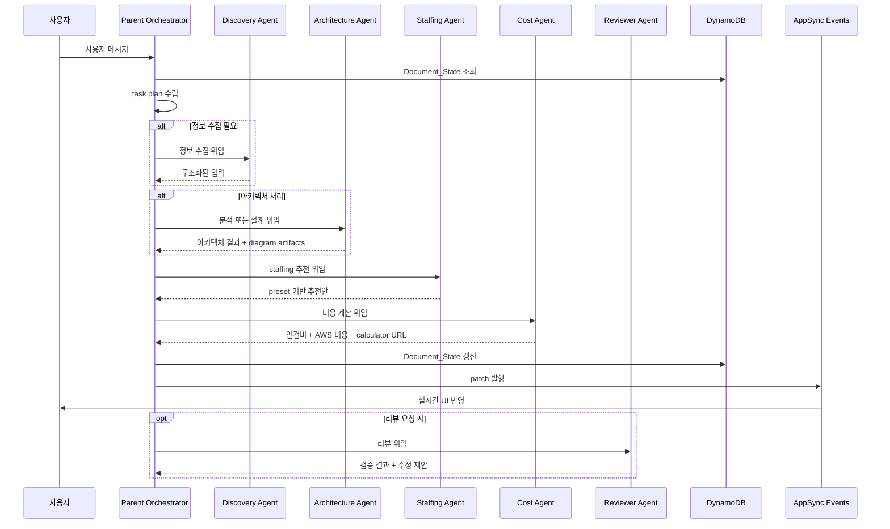
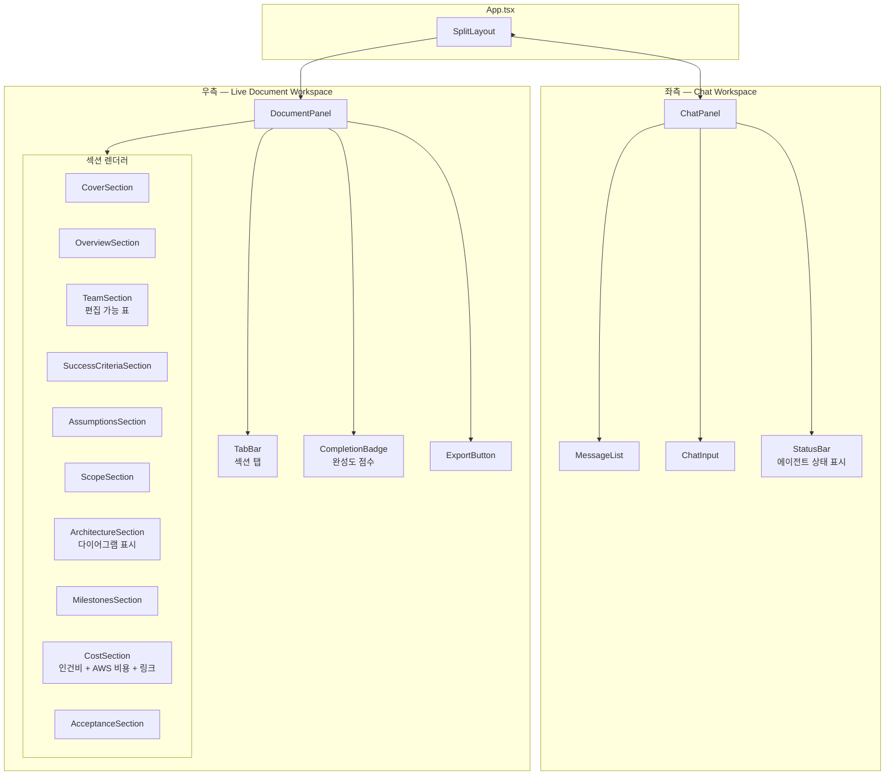

# Design Document — AgentCore 멀티에이전트 문서 생성 시스템

## Overview

이 시스템은 AgentCore Runtime 위의 Parent Orchestrator가 사용자 채팅 입력을 받아, Parent를 포함한 총 7개 에이전트와 MCP 도구를 오케스트레이션하여 APN PoC Project Plan 문서를 실시간으로 생성·수정하는 해커톤용 멀티에이전트 문서 생성 시스템이다.

핵심 설계 결정:
- **이중 진입 구조**: 기존 아키텍처 유무에 따라 분석 모드 / 설계 보조 모드로 분기하되, 중간 이후는 동일한 문서·비용·리뷰 파이프라인으로 합류
- **JSON canonical state**: DynamoDB에 저장되는 JSON이 문서의 source of truth. DOCX는 이 상태의 렌더링 결과
- **user_input / ai_recommended / calculated / status 분리**: 세일즈가 AI 추천을 수정한 이력을 추적하고, 계산값은 입력 변경 시 자동 재계산
- **preset 기반 추천**: LLM이 매번 역할/단가를 생성하지 않고, 사전 분석된 preset에서 선택·보정·설명
- **AppSync Events 실시간 동기화**: patch 단위로 문서 변경을 프런트엔드에 즉시 반영
- **SCP 제약 대응**: Bedrock Haiku만 동작하는 환경에서 LLM 추론 품질을 preset과 deterministic 계산으로 보완
- **Terraform + Python CDK 분리**: 기반 인프라는 Terraform, AgentCore 계층은 Python CDK

## Architecture

### 전체 시스템 아키텍처

```mermaid
graph TB
    subgraph Frontend["front/ — 웹 UI"]
        CW[Chat Workspace<br/>좌측 패널]
        LDW[Live Document Workspace<br/>우측 패널]
    end

    subgraph AppSync["AppSync Events"]
        PATCH_CH["docs/{docId}/patch"]
        STATUS_CH["docs/{docId}/status"]
        CHAT_CH["docs/{docId}/chat"]
        ON_PUB[OnPublish Lambda<br/>patch 검증/차단]
    end

    subgraph AgentLayer["agent/ — 에이전트 실행 계층"]
        PO[Parent Orchestrator<br/>AgentCore Runtime]
        DA[Discovery Agent]
        AA[Architecture Agent]
        SA[Staffing Agent]
        CA[Cost Agent]
        RA[Reviewer Agent]
        FA[Formatter Agent]
    end

    subgraph ToolLayer["도구 계층"]
        GW[AgentCore Gateway]
        VTC[validate_template_constraints]
        GAD[generate_architecture_diagram]
        EC[estimate_cost]
        CSC[calculate_staffing_cost]
        ED[export_docx]
        BMS[build_milestone_summary]
        CMCP[Calculator MCP<br/>aws-calculator-mcp]
    end

    subgraph MemoryLayer["기억 계층"]
        MEM[AgentCore Memory]
        ST[Short-term<br/>세션 문맥]
        LT[Long-term<br/>고객 특성/리전 제약]
    end

    subgraph Storage["저장 계층"]
        DDB[(DynamoDB<br/>Document State)]
        S3[(S3<br/>artifacts)]
    end

    subgraph Infra["infra/ — 배포"]
        TF[Terraform<br/>기반 인프라]
        CDK[Python CDK<br/>AgentCore 계층]
        CB[CodeBuild<br/>패키징/배포]
    end

    CW -->|사용자 메시지| PO
    PO -->|patch| ON_PUB --> PATCH_CH --> LDW
    PO -->|status| STATUS_CH --> LDW
    PO -->|chat 응답| CHAT_CH --> CW

    PO --> DA & AA & SA & CA & RA & FA
    PO --> GW
    GW --> VTC & GAD & EC & CSC & ED & BMS
    CA --> CMCP

    PO --> MEM
    MEM --> ST & LT

    PO --> DDB
    AA --> S3
    FA --> S3
    CA --> S3

    TF --> DDB & S3
    CDK --> PO
    CB --> S3
```



### 배포 아키텍처 — Terraform / Python CDK 분리

| 계층 | 도구 | 리소스 |
|------|------|--------|
| **기반 인프라** | Terraform | IAM, S3, DynamoDB, Lambda (OnPublish, Gateway targets), AppSync Events, CodeBuild, CloudFront (프런트 호스팅), Diagram Service 인프라 (조건부) |
| **AgentCore 계층** | Python CDK (boto3) | AgentCore Runtime, Endpoint, Gateway, Gateway target 등록, Memory, agent zip 업로드 연결 |
| **빌드/패키징** | CodeBuild | agent/ 소스 ZIP 패키징 → S3 업로드 → AgentCore Runtime 갱신 트리거 |
| **프런트엔드** | npm | 정적 빌드 → S3 + CloudFront 또는 로컬 dev 서버 |

배포 명령은 최대 3회:
1. `AWS_PROFILE=mzadmin terraform -chdir=infra/terraform apply`
2. `AWS_PROFILE=mzadmin python infra/cdk/deploy.py --env demo`
3. `cd front && npm run build && npm run deploy` (선택)

### 에이전트 간 통신 패턴

Parent Orchestrator는 **hub-and-spoke** 패턴으로 동작한다. 하위 에이전트 간 직접 통신은 없으며, 모든 조율은 Parent를 경유한다.



위임 방식:
- Parent → 하위 에이전트: AgentCore Runtime 내부 호출 (동일 Runtime 내 함수 호출 또는 별도 Runtime invoke)
- Parent → Gateway 도구: AgentCore Gateway MCP 프로토콜 호출
- Cost 계산과 Diagram 생성은 공식적으로 AgentCore_Gateway를 경유한 MCP 도구 호출 경로를 사용한다.
- Cost_Agent와 Architecture_Agent는 직접 외부 MCP 서버를 호출하지 않고, Parent_Orchestrator 또는 Gateway adapter를 통해 간접 호출한다.


## Components and Interfaces

### 1. Parent Orchestrator (agent/app/parent/)

문서 상태 기계 겸 라우터. 사용자 메시지를 수신하면 Document_State를 조회하고, task plan을 수립하여 하위 에이전트/도구에 위임한다.

**인터페이스:**
```python
class ParentOrchestrator:
    async def handle_message(self, doc_id: str, user_message: str) -> TaskPlan:
        """사용자 메시지 → task plan 수립 → 위임 → patch 발행"""

    async def delegate_task(self, agent_name: str, task: Task, doc_state: DocumentState) -> AgentResult:
        """하위 에이전트에 작업 위임"""

    async def publish_patch(self, doc_id: str, patches: list[Patch]) -> None:
        """AppSync Events로 patch 발행"""

    async def publish_status(self, doc_id: str, status: AgentStatus) -> None:
        """처리 상태 발행"""
```

**상태 전이:**
```
IDLE → PLANNING → DELEGATING → PATCHING → RESPONDING → IDLE
```

### 2. Discovery Agent (agent/app/discovery/)

프로젝트 정보 수집 및 구조화. draft-required inputs와 export-required inputs를 구분한다.

**인터페이스:**
```python
class DiscoveryAgent:
    async def collect_info(self, user_input: str, doc_state: DocumentState) -> DiscoveryResult:
        """입력 분석 → 누락 항목 판별 → 구조화 또는 재질문 생성"""

    def classify_missing_fields(self, doc_state: DocumentState) -> MissingFields:
        """draft-required vs export-required 분류"""
```

**draft-required inputs** (초안 생성에 필수):
- 고객사명, 프로젝트 목표, 대략적 범위, 아키텍처 유무

**export-required inputs** (DOCX export에 필수):
- Sponsor, Stakeholder, Team 상세, phase별 일정, 비용/리소스 정보

### 3. Architecture Agent (agent/app/architecture/)

이중 진입 모드에 따라 분석 또는 설계 보조를 수행한다.

**인터페이스:**
```python
class ArchitectureAgent:
    async def analyze_existing(self, drawio_content: str, doc_state: DocumentState) -> ArchitectureResult:
        """기존 .drawio 파싱 → AWS 서비스 추출 → 해석/보완"""

    async def design_new(self, project_context: ProjectContext, doc_state: DocumentState) -> ArchitectureResult:
        """프로젝트 요구사항 → AWS 아키텍처 초안 생성"""

    async def generate_diagram(self, architecture: ArchitectureResult) -> DiagramArtifacts:
        """Diagram Service 호출 → .drawio + .png/.svg → S3 저장"""
```

### 4. Staffing Agent (agent/app/staffing/)

preset 기반 역할/단가 추천. LLM이 매번 생성하지 않고, 사전 분석된 preset에서 선택·보정·설명한다.

**인터페이스:**
```python
class StaffingAgent:
    async def recommend(self, architecture: ArchitectureResult, scope: ScopeInfo, doc_state: DocumentState) -> StaffingRecommendation:
        """프로젝트 유형 → preset 선택 → 역할별 추천안 생성"""

    def validate_rates(self, recommendation: StaffingRecommendation) -> list[RateViolation]:
        """rate_card.json 범위 검증"""
```

### 5. Cost Agent (agent/app/cost/)

인건비 계산 (deterministic) + AWS 서비스 비용 계산 (Calculator MCP).

**인터페이스:**
```python
class CostAgent:
    def calculate_staffing_cost(self, staffing_plan: StaffingPlan) -> StaffingCostResult:
        """역할별 count × allocation × rate × hours → total cost (순수 함수)"""

    async def calculate_aws_cost(self, services: list[AWSService], gateway_client: GatewayClient) -> AWSCostResult:
        """Gateway의 estimate_cost 도구 호출 → 서비스별 비용 + shareable URL"""

    def generate_fallback_card(self, services: list[AWSService], partial_results: dict) -> FallbackCard:
        """비용 추정 실패 또는 일부 unsupported service 발생 시 요약 카드 생성"""
```

인건비 계산은 `staffing_plan`과 관련 planning 입력(phase별 hours, milestone context)을 기준으로 deterministic하게 수행한다. 연락처/조직 정보 성격의 `stakeholders` 섹션 데이터는 인건비 계산의 직접 입력으로 사용하지 않는다.

### 6. Reviewer Agent (agent/app/reviewer/)

APN 템플릿 규격 검증 및 불일치 탐지.

**인터페이스:**
```python
class ReviewerAgent:
    def review(self, doc_state: DocumentState) -> ReviewResult:
        """필수 섹션 누락 + 순서 검증 + 숫자 불일치 + completion score"""

    def calculate_completion_score(self, doc_state: DocumentState) -> float:
        """섹션별 필수 필드 채움 비율 → 0.0~1.0"""

    def classify_issues(self, issues: list[Issue]) -> tuple[list[BlockingIssue], list[Warning]]:
        """blocking vs non-blocking 분류"""
```

### 7. Formatter Agent (agent/app/formatter/)

문서 정렬 및 DOCX export.

**인터페이스:**
```python
class FormatterAgent:
    async def export_docx(self, doc_state: DocumentState) -> ExportResult:
        """Document_State → APN 템플릿 순서 정렬 → DOCX 생성 → S3 저장"""
```

### 8. AgentCore Gateway 도구 매핑

Gateway는 Lambda를 MCP 도구로 노출한다. 논리 도구명과 Gateway 노출 도구명의 매핑은 다음과 같다.

| # | 논리 도구명 (설계/코드 내부) | Gateway 노출 도구명 (MCP tool name) | Lambda 함수명 | 설명 |
|---|---|---|---|---|
| 1 | `validate_template` | `validate_template_constraints` | `doc-agent-validate-template` | APN 템플릿 필수 섹션/순서 검증 |
| 2 | `generate_diagram` | `generate_architecture_diagram` | `doc-agent-generate-diagram` | draw.io + preview 생성 |
| 3 | `estimate_aws_cost` | `estimate_cost` | `doc-agent-estimate-cost` | Calculator MCP 래핑 |
| 4 | `calculate_staffing` | `calculate_staffing_cost` | `doc-agent-calc-staffing` | 인건비 deterministic 계산 |
| 5 | `export_document` | `export_docx` | `doc-agent-export-docx` | DOCX 생성 + S3 저장 |
| 6 | `build_milestones` | `build_milestone_summary` | `doc-agent-build-milestones` | phase/deliverable/역할 동기화 |

**명명 규칙:**
- Gateway 노출 도구명: snake_case, 동사_명사 패턴 (MCP 프로토콜 표준)
- Lambda 함수명: `doc-agent-` 접두사 + kebab-case
- 코드 내부 논리명: 축약된 snake_case

### 9. AppSync Events 채널 구조

```
docs/{docId}/patch    — 문서 상태 변경 patch (JSON Patch 형식)
docs/{docId}/status   — 에이전트 처리 상태 (processing, idle, error)
docs/{docId}/chat     — 에이전트 → 사용자 채팅 응답
docs/{docId}/trace    — 디버깅용 에이전트 실행 추적 (개발 모드 전용)
```

**Patch 메시지 형식:**
```json
{
  "patch_id": "p-20250701-001",
  "doc_id": "doc-001",
  "agent": "staffing_agent",
  "timestamp": "2025-07-01T10:30:00Z",
  "operations": [
    {
      "op": "replace",
      "path": "/staffing_plan/roles/project_manager/count/ai_recommended",
      "value": 1,
      "source": "ai_recommended"
    }
  ],
  "version": 42
}
```

**OnPublish Lambda 검증 규칙:**
- `operations[].path`가 유효한 Document_State 경로인지 확인
- `version`이 현재 DynamoDB 버전과 일치하는지 확인 (optimistic locking)
- `source`가 허용된 값(`user_input`, `ai_recommended`, `calculated`)인지 확인
- 검증 실패 시 patch 차단 + status 채널로 오류 발행

### 10. 프런트엔드 컴포넌트 구조 (front/)



**주요 컴포넌트 역할:**

| 컴포넌트 | 역할 |
|----------|------|
| `SplitLayout` | 좌우 분할 레이아웃. 리사이즈 가능 |
| `ChatPanel` | AppSync `chat` 채널 구독. 메시지 송수신 |
| `StatusBar` | AppSync `status` 채널 구독. 에이전트 처리 상태 표시 |
| `DocumentPanel` | AppSync `patch` 채널 구독. patch 수신 → 로컬 상태 적용 |
| `TabBar` | 10개 섹션 탭 (Cover~Acceptance). Resources & Cost Estimates는 Cost 탭 내 서브섹션 |
| `CompletionBadge` | completion score 실시간 표시 |
| `ExportButton` | blocking issue 없을 때 활성화. DOCX 다운로드 트리거 |
| `TeamSection` | 편집 가능한 표. 수정 시 `user_input`으로 Document_State 갱신 → 비용 재계산 트리거 |
| `CostSection` | 인건비 표 + AWS 비용 breakdown + calculator.aws 링크 + fallback card |
| `ArchitectureSection` | .png/.svg preview 표시 + draw.io 원본 다운로드 링크 |

**상태 관리:**
- 프런트엔드 로컬 상태: React state (또는 Zustand)로 Document_State의 클라이언트 사본 유지
- patch 수신 시: JSON Patch 적용으로 로컬 상태 갱신
- 사용자 편집 시: 로컬 상태 즉시 갱신 + REST API로 서버에 `user_input` 변경 전송
- fallback: AppSync 연결 끊김 시 REST polling으로 전체 Document_State 재조회

### 11. 사용자 편집 Write API

프런트엔드의 인라인 편집 결과는 다음 write API를 통해 서버에 반영한다.

| 메서드 | 경로 | 설명 |
|---|---|---|
| `POST` | `/documents/{docId}/user-input` | 사용자 편집값을 `user_input`으로 저장 |
| `POST` | `/documents/{docId}/review` | 리뷰 요청 |
| `POST` | `/documents/{docId}/export` | DOCX export 요청 |
| `GET` | `/documents/{docId}` | Document_State 전체 조회 (fallback용) |

**`/documents/{docId}/user-input` 요청 예시:**
```json
{
  "path": "/staffing_plan/roles/project_manager/count/user_input",
  "value": 2,
  "edited_by": "user"
}
```

서버는 이 값을 반영한 뒤 Parent_Orchestrator 또는 patch engine을 통해 Document_State를 갱신하고, 결과 patch를 AppSync Events로 발행한다.


## Data Models

### 1. Document_State — JSON Canonical State (DynamoDB)

DynamoDB 테이블: `doc-agent-documents`
- Partition Key: `document_id` (String)
- Sort Key: 없음 (단일 문서 = 단일 아이템)

```json
{
  "document_id": "doc-001",
  "template": "apn_poc_project_plan",
  "mode": "architecture_present | architecture_absent",
  "version": 42,
  "created_at": "2025-07-01T09:00:00Z",
  "updated_at": "2025-07-01T10:30:00Z",
  "meta": {
    "customer": { "user_input": "ABC Corp", "ai_recommended": null, "status": "confirmed" },
    "partner": { "user_input": "MZC", "ai_recommended": null, "status": "confirmed" },
    "date": { "user_input": "2025-07-15", "ai_recommended": null, "status": "confirmed" }
  },
  "sections": {
    "cover": { ... },
    "executive_summary": { ... },
    "stakeholders": { ... },
    "success_criteria": { ... },
    "assumptions": { ... },
    "scope_of_work": { ... },
    "architecture": { ... },
    "milestones": { ... },
    "cost_breakdown": { ... },
    "acceptance": { ... },
    "resources_cost_estimates": { ... }
  },
  "staffing_plan": { ... },
  "completion_score": 0.65,
  "blocking_issues": [],
  "warnings": []
}
```

### 2. 섹션 내부 키 명명 규칙

모든 섹션 키는 **snake_case**를 사용한다. APN 템플릿 섹션명과 내부 상태 키의 매핑:

| APN 템플릿 섹션 | Document_State 키 | 비고 |
|---|---|---|
| Cover Page | `cover` | |
| Executive Summary | `executive_summary` | |
| Sponsor / Stakeholder / Team | `stakeholders` | 연락처/조직 정보 |
| Staffing / Resource Planning (내부 모델) | `staffing_plan` | 계산 및 추천용 내부 상태. sections 외부 최상위 키 |
| Success Criteria / KPIs | `success_criteria` | |
| Assumptions & Risks | `assumptions` | |
| Scope of Work | `scope_of_work` | `scope`가 아닌 `scope_of_work`로 통일 |
| Architecture | `architecture` | |
| Milestones & Deliverables | `milestones` | |
| Cost Breakdown | `cost_breakdown` | |
| Acceptance Criteria | `acceptance` | |
| Resources & Cost Estimates | `resources_cost_estimates` | Cost 탭 내 서브섹션 |

### 3. 필드 값 구조 — 4속성 패턴

모든 편집 가능한 필드는 다음 구조를 따른다:

```json
{
  "user_input": "<사용자가 직접 입력한 값 또는 null>",
  "ai_recommended": "<AI가 추천한 값 또는 null>",
  "calculated": "<시스템이 계산한 값 또는 null>",
  "status": "empty | recommended | user_modified | confirmed | calculated",
  "user_edited": false,
  "reason": "추천 이유 (ai_recommended일 때)",
  "source_patterns": ["preset_genai_multi_agent_v2"],
  "confidence": 0.85
}
```

**축약형 허용 규칙:**
- read-only derived field(예: `total_hours`, `total_cost`, `grand_total`)는 완전한 4속성 래퍼 대신 `{ "calculated": ... }` 형태의 축약형을 사용할 수 있다.
- 사용자 편집 가능 필드는 반드시 `user_input / ai_recommended / calculated / status` 구조를 따라야 한다.

**status 전이:**
```
empty → recommended (AI 추천 시)
recommended → user_modified (사용자 수정 시)
recommended → confirmed (사용자 승인 시)
empty → user_modified (사용자 직접 입력 시)
* → calculated (시스템 계산 결과)
```

### 4. Staffing Plan 상세 스키마

```json
{
  "staffing_plan": {
    "roles": {
      "project_manager": {
        "role_id": "project_manager",
        "display_name": "Project Manager",
        "count": { "user_input": null, "ai_recommended": 1, "status": "recommended" },
        "allocation_pct": { "user_input": null, "ai_recommended": 50, "status": "recommended" },
        "rate_per_hour": { "user_input": null, "ai_recommended": 81.78, "status": "recommended" },
        "phase_hours": {
          "discovery": { "user_input": null, "ai_recommended": 40, "status": "recommended" },
          "development": { "user_input": null, "ai_recommended": 80, "status": "recommended" },
          "testing": { "user_input": null, "ai_recommended": 20, "status": "recommended" }
        },
        "total_hours": { "calculated": 140 },
        "total_cost": { "calculated": 11449.20 },
        "reason": "6개 서비스 연동, 4주 일정 관리 필요",
        "source_patterns": ["preset_genai_multi_agent_v2"],
        "user_edited": false
      }
    },
    "grand_total_hours": { "calculated": 560 },
    "grand_total_cost": { "calculated": 45796.80 }
  }
}
```

### 5. Cost Breakdown 섹션 상세 스키마

```json
{
  "cost_breakdown": {
    "staffing_cost": {
      "roles_summary": [
        {
          "role_id": "project_manager",
          "display_name": "Project Manager",
          "total_hours": 140,
          "rate_per_hour": 81.78,
          "total_cost": 11449.20
        }
      ],
      "grand_total": { "calculated": 45796.80 }
    },
    "aws_service_cost": {
      "monthly_cost_summary": { "calculated": 1113.68 },
      "service_breakdown": [
        {
          "service_name": "AWS Lambda",
          "service_code": "aWSLambda",
          "monthly_cost": 244.13,
          "parameters_snapshot": { ... },
          "supported_by_calculator": true
        }
      ],
      "calculator_share_url": "https://calculator.aws/#/estimate?id=...",
      "fallback_card": null,
      "manual_estimate_items": []
    },
    "total_project_cost": { "calculated": 46910.48 }
  }
}
```

### 6. Preset 데이터 파일 (agent/data/presets/)

| 파일 | 용도 | 키 구조 |
|------|------|---------|
| `role_catalog.json` | 역할 정의 (ID, 표시명, 설명, 기본 스킬) | `{ "project_manager": { "display_name": "...", "skills": [...] } }` |
| `rate_card.json` | 역할별 단가 범위 (min, default, max) | `{ "project_manager": { "min": 60, "default": 81.78, "max": 120 } }` |
| `staffing_presets.json` | 프로젝트 유형별 역할 조합 템플릿 | `{ "genai_multi_agent": { "roles": { "pm": { "count": 1, ... } } } }` |
| `phase_hour_patterns.json` | 프로젝트 유형별 phase 시간 배분 패턴 | `{ "genai_multi_agent": { "discovery": 0.2, "dev": 0.6, "test": 0.2 } }` |
| `project_type_rules.json` | 프로젝트 유형 판별 규칙 | `{ "rules": [{ "keywords": [...], "type": "genai_multi_agent" }] }` |

### 7. S3 Artifact 구조

```
s3://doc-agent-artifacts-{account_id}/
├── docs/{docId}/
│   ├── diagrams/
│   │   ├── architecture.drawio
│   │   ├── architecture.png
│   │   └── architecture.svg
│   ├── exports/
│   │   └── {docId}-v{version}.docx
│   └── cost/
│       ├── calculator_snapshot.json
│       └── fallback_card.json
```

### 8. DynamoDB 추가 테이블

**패치 이력 테이블:** `doc-agent-patch-history`
- Partition Key: `document_id` (String)
- Sort Key: `patch_id` (String)
- 용도: auditable mapping (사용자 메시지 → 위임 작업 → 결과 patch)

```json
{
  "document_id": "doc-001",
  "patch_id": "p-20250701-001",
  "user_message_id": "msg-001",
  "agent": "staffing_agent",
  "task_type": "recommend_staffing",
  "operations": [...],
  "timestamp": "2025-07-01T10:30:00Z",
  "version_before": 41,
  "version_after": 42
}
```

