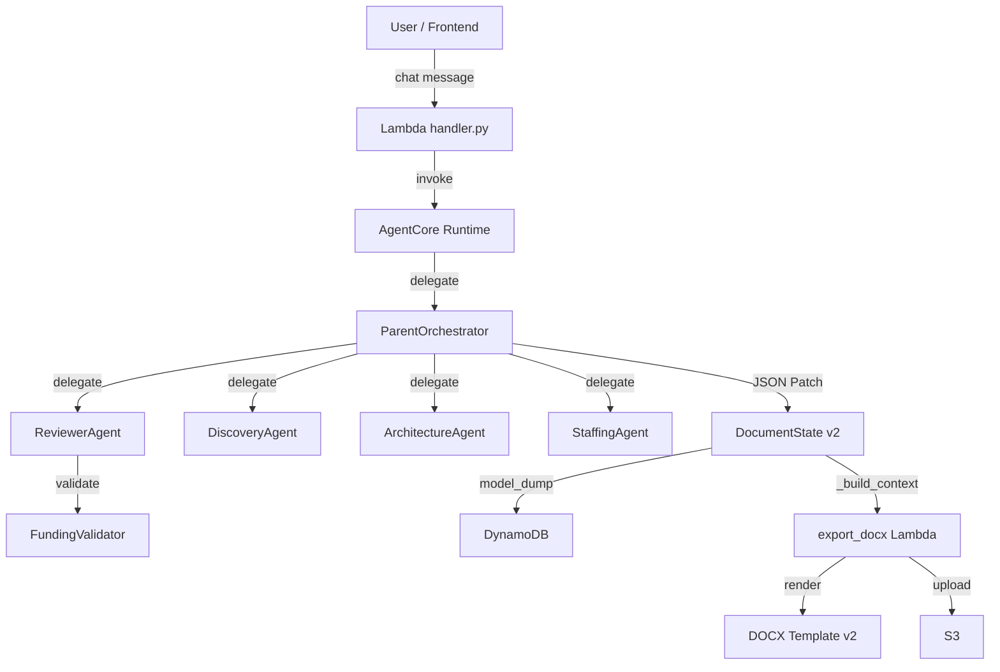

# Design Document: APN Template v2 Rewrite

## Overview

This design covers a breaking rewrite of the Doc Agent's core data layer and export pipeline to align with the APN PoC DOCX template v2 (`apn-poc-template_v2.docx`). The rewrite touches four subsystems:

1. **DocumentState schema** (`agent/lib/schema/document_state.py`) — Pydantic v2 models redesigned to match v2 template placeholders
2. **Export pipeline** (`agent/lambdas/gateway_tools/export_docx.py`) — `_build_context()` rewritten to produce only v2 context keys
3. **FundingValidator** (`agent/app/funding/funding_validator.py`) — field path updates to read from v2 schema locations
4. **Agent patch paths** — all agents (Discovery, Architecture, Staffing, Reviewer, Orchestrator) updated to target v2 JSON Patch paths

No backward compatibility is maintained. All legacy fields, aliases, and v1 fallback paths are removed. The AgentCore Gateway response shape (`{"outputPayload": json.dumps(payload)}`) is preserved.

### Design Rationale

The v1 schema accumulated organic growth: `FieldValue` carried metadata fields (`reason`, `source_patterns`, `confidence`) that belong on the agent result, not the field itself. Staffing data lived in a top-level `staffing_plan` separate from sections, creating dual sources of truth. The export pipeline had extensive legacy fallback paths (`text` vs `summary`, `description` vs `overview`) that made the template mapping ambiguous. The v2 rewrite eliminates all of this while keeping the schema structured where the template requires it (nested BusinessCase, structured AcceptanceStep, typed PhaseHours/TotalsRow/TeamMember models).

## Architecture

The system architecture remains unchanged — this is a data-layer refactoring, not a structural change.



### Change Scope

| Component | File | Change Type |
|-----------|------|-------------|
| DocumentState schema | `agent/lib/schema/document_state.py` | Rewrite models |
| Export pipeline | `agent/lambdas/gateway_tools/export_docx.py` | Rewrite `_build_context()` |
| FundingValidator | `agent/app/funding/funding_validator.py` | Update field paths |
| DiscoveryAgent | `agent/app/discovery/discovery_agent.py` | Update patch paths |
| ReviewerAgent | `agent/app/reviewer/reviewer_agent.py` | Update field references |
| Orchestrator | `agent/app/parent/orchestrator.py` | Update delegation patch paths |
| Terraform | `infra/terraform/main.tf` | Update `TEMPLATE_S3_KEY` env var |
| upload_template.py | `infra/scripts/upload_template.py` | Update defaults |
| upload_template.sh | `infra/scripts/upload_template.sh` | Update default path |

## Components and Interfaces

### 1. FieldValue v2

**v2 Design:**
```python
class FieldStatus(str, Enum):
    empty = "empty"
    draft = "draft"
    confirmed = "confirmed"

class FieldValue(BaseModel):
    user_input: Any = None
    ai_recommended: Any = None
    calculated: Any = None
    status: FieldStatus = FieldStatus.empty
    user_edited: bool = False

    def resolve(self) -> Any:
        for v in (self.user_input, self.ai_recommended, self.calculated):
            if v is not None and v != "":
                return v
        return ""
```

**Removed:** `reason`, `source_patterns`, `confidence`, `CalculatedOnly` class, `FieldStatus.recommended`, `FieldStatus.user_modified`, `FieldStatus.calculated`.

### 2. Section Models v2

#### ExecutiveSummarySection

**Removed:** `text`, `summary`

**Kept:** `business_case: BusinessCase` (nested sub-model — NOT flattened)

**Added:** `customer_intro`, `problem_statement`, `proposed_solution`, `phases_overview` (list[FieldValue]), `current_pain_points` (list[FieldValue]), `poc_objectives` (list[FieldValue]), `custom_blocks` (list[dict])

**Decision:** BusinessCase remains nested. The export context builder maps `business_case.problem_definition` → `business_case_problem`, etc. This keeps the schema structured for agent patching (`/sections/executive_summary/business_case/problem_definition`) while the template gets flat keys. `phases_overview`, `current_pain_points`, and `poc_objectives` are `list[FieldValue]` because the template renders them as bullet lists.

#### CategoryGroup

**Changed:** `category_name` stays FieldValue, `items: list[FieldValue]` → `bullets: list[FieldValue]`

**Decision:** The template iterates `group.bullets`. The field name must match. `bullets` remains `list[FieldValue]` (not `list[str]`) because the UI and agent patch flow need the 4-property pattern.

#### ContactEntry

**Removed:** `role_or_description` only

**Kept:** `name`, `title`, `description`, `stakeholder_for`, `role`, `contact` (all FieldValue)

**Decision:** The template requires `executive_sponsors[].description`, `stakeholders[].stakeholder_for`, `project_team[].role`, `escalation_contacts[].role`. All these fields must remain on ContactEntry.

#### ScopeTask

**Kept as FieldValue:** `task_category`, `schedule`, `details`, `personnel` — all remain FieldValue

**Decision:** The UI and agent patch flow need `user_input / ai_recommended / calculated` support. `details` changes from `list[FieldValue]` to a single `FieldValue` (the template renders it as one text block).

#### ScopeOfWorkSection

**Kept:** `tasks: list[ScopeTask]`, `out_of_scope: list[FieldValue]`, `items: list[FieldValue]`

**Export mapping:** `tasks` → `scope_tasks`, `out_of_scope` → `scope_out_of_scope`, `items` → `scope_items`

**Decision:** The template requires all three context keys. `out_of_scope` and `items` are ungrouped fallback lists.

#### ArchitectureSection

**Removed:** `description`, `tools`

**Added/Kept:** `overview` (FieldValue), `diagram_image_s3_key` (FieldValue — S3 key), `services` (list[ArchitectureService]), `tools_list` (list[FieldValue])

**Export mapping:** `diagram_image_s3_key` → context key `architecture_diagram_image`, `tools_list` → context key `architecture_tools_list`

#### AcceptanceSection

**Removed:** `text`

**Added:** `steps: list[AcceptanceStep]`

```python
class AcceptanceStep(BaseModel):
    heading: FieldValue = Field(default_factory=FieldValue)
    content: FieldValue = Field(default_factory=FieldValue)
    bullets: list[FieldValue] = Field(default_factory=list)
```

**Export mapping:** `acceptance.steps` → context key `acceptance_steps` (each step rendered with heading, content, bullets)

#### CostBreakdownSection

**Removed:** nested `aws_service_cost`, `staffing_cost`, `document_local_summary`

**Added (clean schema names):** `calculator_url` (FieldValue), `mrr` (FieldValue), `arr` (FieldValue), `breakdown_table` (list[CostBreakdownRow]), `bedrock_extra` (FieldValue), `funding_calculation` (dict)

**Export mapping:** `calculator_url` → `aws_calculator_url`, `mrr` → `aws_mrr`, `arr` → `aws_arr`, `breakdown_table` → `aws_cost_breakdown_table`, `bedrock_extra` → `aws_bedrock_extra`

#### ResourcesCostEstimatesSection

**Added (typed models):**
- `partner_technical_team: list[TeamMember]` — template loops `member.role`, `member.name`
- `phase_hours_table: list[PhaseHours]` — typed rows with `phase`, `sa_hours`, `eng_hours`, `other_hours`, `total`
- `total_hours: TotalsRow` — template accesses `.sa`, `.eng`, `.other`, `.total`
- `total_cost: TotalsRow` — same structure
- `rate_solution_architect`, `rate_engineer`, `rate_other` (FieldValue)
- `contribution` (Contribution)
- Client signature fields (FieldValue)

```python
class TeamMember(BaseModel):
    role: FieldValue = Field(default_factory=FieldValue)
    name: FieldValue = Field(default_factory=FieldValue)

class PhaseHours(BaseModel):
    phase: FieldValue = Field(default_factory=FieldValue)
    sa_hours: int = 0
    eng_hours: int = 0
    other_hours: int = 0
    total: int = 0

class TotalsRow(BaseModel):
    sa: str = ""
    eng: str = ""
    other: str = ""
    total: str = ""
```

### 3. Model Strictness

All section models use `extra="forbid"` to prevent typos, **except** `CoverSection` which uses `extra="allow"` because agents write dynamic project metadata fields to the cover at runtime.

### 4. Export Pipeline v2 — `_build_context()`

The context builder maps schema fields to template context keys:

1. Read from v2 schema paths only (no legacy fallbacks)
2. Keep `resolve_field_value()` for raw dict inputs (Lambda receives dicts, not Pydantic models)
3. Map nested `business_case.*` → flat `business_case_*` context keys
4. Map `diagram_image_s3_key` → `architecture_diagram_image`
5. Map `tools_list` → `architecture_tools_list`
6. Map `calculator_url` → `aws_calculator_url`, `mrr` → `aws_mrr`, `arr` → `aws_arr`, `breakdown_table` → `aws_cost_breakdown_table`, `bedrock_extra` → `aws_bedrock_extra`
7. Map `acceptance.steps` → `acceptance_steps`
8. Read staffing/signature data from `resources_cost_estimates`
9. Remove all legacy context keys

**Template S3 key:** `TEMPLATE_S3_KEY = "templates/apn-poc-template_v2.docx"`

**Response shape preserved:** `{"outputPayload": json.dumps(payload, ensure_ascii=False)}`

### 5. FundingValidator v2 — Field Path Updates

| Method | v1 Path | v2 Path |
|--------|---------|---------|
| `has_calculator_url` | `cost_breakdown.aws_service_cost.calculator_share_url` | `cost_breakdown.calculator_url` |
| `_sow_cost` | `staffing_plan.grand_total_cost` | `resources_cost_estimates.total_cost` |
| `_business_case_has` | `executive_summary.business_case.problem_definition` | `executive_summary.business_case.problem_definition` (unchanged — BusinessCase stays nested) |
| `has_bedrock` | `architecture.services` | `architecture.services` (unchanged) |
| `_aws_annual_cost` | `cost_breakdown.aws_service_cost.monthly_cost_summary` | `cost_breakdown.arr` |
| `calculate_funding` | same formula | `eligible_amount = min(yr1_arr * 0.25, sow_cost, 125000)` (unchanged) |

### 6. Agent Patch Paths v2

| Agent | v1 Path | v2 Path |
|-------|---------|---------|
| Discovery | `/meta/project_goal` | `/sections/executive_summary/customer_intro` |
| Discovery | `/sections/executive_summary/text` | `/sections/executive_summary/problem_statement` |
| Orchestrator (arch) | `/sections/architecture/description` | `/sections/architecture/overview` |
| Orchestrator (arch) | `/sections/architecture/tools` | `/sections/architecture/tools_list` |
| Orchestrator (staffing) | `/staffing_plan/roles/...` | `/sections/resources_cost_estimates/...` |
| Reviewer | `doc_state.staffing_plan.roles` | `doc_state.sections.resources_cost_estimates` |

### 7. Template Deployment Updates

| File | Field | v1 Value | v2 Value |
|------|-------|----------|----------|
| `export_docx.py` | `TEMPLATE_S3_KEY` | `templates/apn-poc-template.docx` | `templates/apn-poc-template_v2.docx` |
| `main.tf` | `TEMPLATE_S3_KEY` env var | `templates/apn-poc-template.docx` | `templates/apn-poc-template_v2.docx` |
| `upload_template.py` | `DEFAULT_KEY` | `templates/apn-poc-template.docx` | `templates/apn-poc-template_v2.docx` |
| `upload_template.py` | `--template` default | `agent/templates/apn-poc-template.docx` | `agent/templates/apn-poc-template_v2.docx` |
| `upload_template.sh` | `TEMPLATE_PATH` default | `agent/templates/apn-poc-template.docx` | `agent/templates/apn-poc-template_v2.docx` |

## Data Models

### Complete v2 Model Hierarchy

```python
# --- New v2 sub-models ---
class TeamMember(BaseModel):
    role: FieldValue = Field(default_factory=FieldValue)
    name: FieldValue = Field(default_factory=FieldValue)

class PhaseHours(BaseModel):
    phase: FieldValue = Field(default_factory=FieldValue)
    sa_hours: int = 0
    eng_hours: int = 0
    other_hours: int = 0
    total: int = 0

class TotalsRow(BaseModel):
    sa: str = ""
    eng: str = ""
    other: str = ""
    total: str = ""

class AcceptanceStep(BaseModel):
    heading: FieldValue = Field(default_factory=FieldValue)
    content: FieldValue = Field(default_factory=FieldValue)
    bullets: list[FieldValue] = Field(default_factory=list)

class CostBreakdownRow(BaseModel):
    category: FieldValue = Field(default_factory=FieldValue)
    mrr: FieldValue = Field(default_factory=FieldValue)
    arr: FieldValue = Field(default_factory=FieldValue)
    note: FieldValue = Field(default_factory=FieldValue)

# --- Kept from v1 (updated) ---
class BusinessCase(BaseModel):  # KEPT — not removed
    problem_definition: FieldValue = Field(default_factory=FieldValue)
    roi_calculation: FieldValue = Field(default_factory=FieldValue)
    executive_sponsor: FieldValue = Field(default_factory=FieldValue)
    production_commitment: FieldValue = Field(default_factory=FieldValue)

class ContactEntry(BaseModel):
    name: FieldValue = Field(default_factory=FieldValue)
    title: FieldValue = Field(default_factory=FieldValue)
    description: FieldValue = Field(default_factory=FieldValue)
    stakeholder_for: FieldValue = Field(default_factory=FieldValue)
    role: FieldValue = Field(default_factory=FieldValue)
    contact: FieldValue = Field(default_factory=FieldValue)
    # role_or_description REMOVED

class CategoryGroup(BaseModel):
    category_name: FieldValue = Field(default_factory=FieldValue)
    bullets: list[FieldValue] = Field(default_factory=list)
    # items REMOVED — template uses group.bullets

class ScopeTask(BaseModel):
    task_category: FieldValue = Field(default_factory=FieldValue)
    schedule: FieldValue = Field(default_factory=FieldValue)
    details: FieldValue = Field(default_factory=FieldValue)  # was list[FieldValue], now single FieldValue
    personnel: FieldValue = Field(default_factory=FieldValue)

# --- Section models (extra="forbid" unless noted) ---
class CoverSection(BaseModel, extra="allow"): pass  # allow: dynamic agent metadata

class ExecutiveSummarySection(BaseModel, extra="forbid"):
    customer_intro: FieldValue = Field(default_factory=FieldValue)
    problem_statement: FieldValue = Field(default_factory=FieldValue)
    proposed_solution: FieldValue = Field(default_factory=FieldValue)
    phases_overview: list[FieldValue] = Field(default_factory=list)
    current_pain_points: list[FieldValue] = Field(default_factory=list)
    poc_objectives: list[FieldValue] = Field(default_factory=list)
    business_case: BusinessCase = Field(default_factory=BusinessCase)  # NESTED, not flat
    custom_blocks: list[dict] = Field(default_factory=list)

class ArchitectureSection(BaseModel, extra="forbid"):
    overview: FieldValue = Field(default_factory=FieldValue)
    diagram_image_s3_key: FieldValue = Field(default_factory=FieldValue)
    services: list[ArchitectureService] = Field(default_factory=list)
    tools_list: list[FieldValue] = Field(default_factory=list)

class CostBreakdownSection(BaseModel, extra="forbid"):
    calculator_url: FieldValue = Field(default_factory=FieldValue)
    mrr: FieldValue = Field(default_factory=FieldValue)
    arr: FieldValue = Field(default_factory=FieldValue)
    breakdown_table: list[CostBreakdownRow] = Field(default_factory=list)
    bedrock_extra: FieldValue = Field(default_factory=FieldValue)
    funding_calculation: dict = Field(default_factory=dict)

class AcceptanceSection(BaseModel, extra="forbid"):
    steps: list[AcceptanceStep] = Field(default_factory=list)

class ResourcesCostEstimatesSection(BaseModel, extra="forbid"):
    partner_technical_team: list[TeamMember] = Field(default_factory=list)
    rate_solution_architect: FieldValue = Field(default_factory=FieldValue)
    rate_engineer: FieldValue = Field(default_factory=FieldValue)
    rate_other: FieldValue = Field(default_factory=FieldValue)
    phase_hours_table: list[PhaseHours] = Field(default_factory=list)
    total_hours: TotalsRow = Field(default_factory=TotalsRow)
    total_cost: TotalsRow = Field(default_factory=TotalsRow)
    contribution: Contribution = Field(default_factory=Contribution)
    client_signature_customer_name: FieldValue = Field(default_factory=FieldValue)
    client_signature_person_name: FieldValue = Field(default_factory=FieldValue)
    client_signature_designation: FieldValue = Field(default_factory=FieldValue)
    client_signature_date: FieldValue = Field(default_factory=FieldValue)
```

### Export Context Key Map (schema → template)

| Schema Path | Context Key |
|-------------|-------------|
| `meta.customer` | `customer` |
| `meta.partner` | `partner` |
| `meta.date` | `date` |
| `executive_summary.customer_intro` | `customer_intro` |
| `executive_summary.problem_statement` | `problem_statement` |
| `executive_summary.proposed_solution` | `proposed_solution` |
| `executive_summary.phases_overview` | `phases_overview` |
| `executive_summary.current_pain_points` | `current_pain_points` |
| `executive_summary.poc_objectives` | `poc_objectives` |
| `executive_summary.business_case.problem_definition` | `business_case_problem` |
| `executive_summary.business_case.roi_calculation` | `business_case_roi` |
| `executive_summary.business_case.executive_sponsor` | `business_case_sponsor` |
| `executive_summary.business_case.production_commitment` | `business_case_commitment` |
| `executive_summary.custom_blocks` | `custom_blocks` |
| `success_criteria.groups` | `success_criteria_groups` (each with `category_name`, `bullets`) |
| `assumptions.groups` | `assumptions_groups` (each with `category_name`, `bullets`) |
| `scope_of_work.tasks` | `scope_tasks` |
| `scope_of_work.out_of_scope` | `scope_out_of_scope` |
| `scope_of_work.items` | `scope_items` |
| `architecture.overview` | `architecture_overview` |
| `architecture.diagram_image_s3_key` | `architecture_diagram_image` |
| `architecture.services` | `architecture_services` |
| `architecture.tools_list` | `architecture_tools_list` |
| `milestones.phases` | `milestones` |
| `cost_breakdown.calculator_url` | `aws_calculator_url` |
| `cost_breakdown.mrr` | `aws_mrr` |
| `cost_breakdown.arr` | `aws_arr` |
| `cost_breakdown.breakdown_table` | `aws_cost_breakdown_table` |
| `cost_breakdown.bedrock_extra` | `aws_bedrock_extra` |
| `acceptance.steps` | `acceptance_steps` |
| `resources_cost_estimates.partner_technical_team` | `partner_technical_team` |
| `resources_cost_estimates.phase_hours_table` | `phase_hours_table` |
| `resources_cost_estimates.total_hours` | `total_hours` (TotalsRow) |
| `resources_cost_estimates.total_cost` | `total_cost` (TotalsRow) |
| `resources_cost_estimates.client_signature_*` | `client_signature_*` |

## Correctness Properties

### Property 1: FieldValue.resolve() priority
`resolve()` returns first non-empty value in order `user_input > ai_recommended > calculated > ""`.

### Property 2: Independent mutable defaults
Two `DocumentState()` instances have independent list fields — mutating one does not affect the other.

### Property 3: Serialization round-trip
`model_dump()` → `json.dumps()` → `json.loads()` → `model_validate()` reconstructs equivalent instances.

### Property 4: Context builder completeness
`_build_context()` produces all required v2 template keys and no legacy keys.

### Property 5: Funding formula
`eligible_amount = min(yr1_arr * 0.25, sow_cost, 125000)` when both positive; `0.0` otherwise.

## Error Handling

- `DocumentState()` with no arguments produces a valid default instance
- `CoverSection` uses `extra="allow"` for dynamic agent metadata; all other sections use `extra="forbid"`
- `_build_context({})` returns all keys with empty/default values — no exception
- Missing diagram image S3 key → `architecture_diagram_image` set to `""`, rendering continues
- All error responses preserve `{"outputPayload": ...}` shape

## Testing Strategy

### Test Framework
- **pytest only** — no hypothesis, no new dev dependencies
- All tests local, fast, deterministic — no AWS calls

### Unit Tests

| Area | Test File | Coverage |
|------|-----------|----------|
| Schema smoke | `agent/lib/schema/test_schema_v2.py` | Instantiation, model_dump, FieldStatus values, FieldValue.resolve(), CategoryGroup.bullets, AcceptanceStep structure, ContactEntry fields, TeamMember/PhaseHours/TotalsRow types, no legacy fields, independent defaults |
| Export context | `agent/lambdas/gateway_tools/test_export_v2.py` | Empty payload, full v2 payload key coverage, schema→template field mapping, architecture service sorting, missing diagram, TEMPLATE_S3_KEY value, no legacy keys |
| FundingValidator | `agent/app/funding/test_funding_v2.py` | Missing Bedrock → blocking, missing sponsor → warning, funding formula, low ARR → warning, JSON serializable, v2 field paths |
| Agent patch paths | `agent/app/test_agent_patch_paths_v2.py` | Discovery v2 paths, no legacy paths, architecture overview/tools_list, staffing → resources_cost_estimates, reviewer funding_calculation |

### Manual Verification
- S3 template upload: `./infra/scripts/upload_template.sh` (post-deploy)
- Real DOCX export: invoke export_docx Lambda with sample payload (post-deploy)
