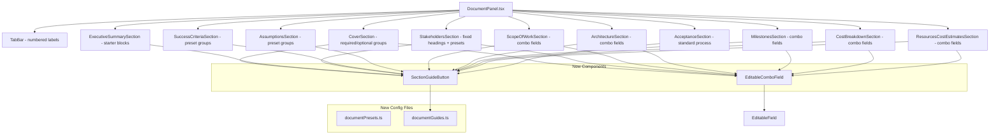
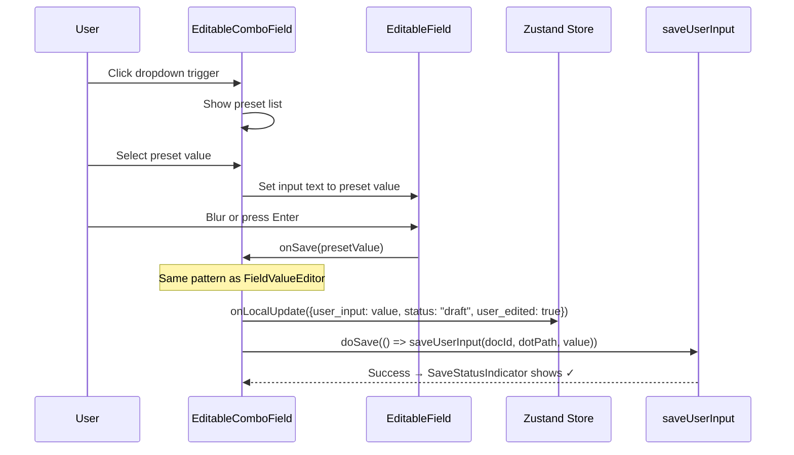
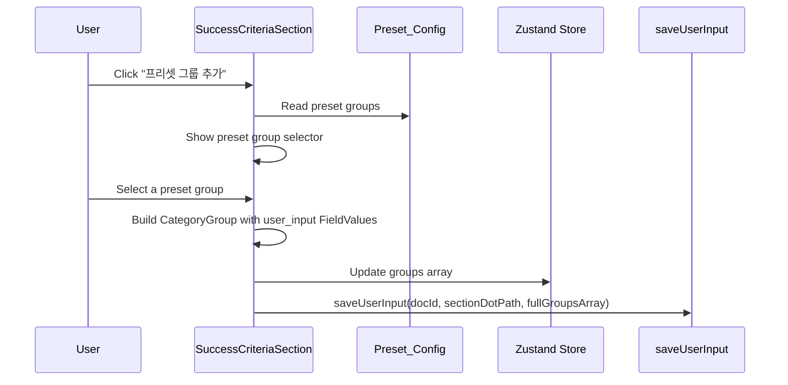

# Design Document: Document Presets & Writing Guides

## Overview

This feature enhances the Live Document editor so users never face a blank page. It adds three layers of assistance across all 11 tabs:

1. **Preset dropdowns** — Reusable `EditableComboField` component that combines a text input with a preset dropdown, used in table cells and form fields across Cover, Stakeholders, Scope of Work, Architecture, Milestones, Cost Breakdown, and Resources sections.
2. **Preset groups** — One-click application of predefined CategoryGroup sets (Success Criteria, Assumptions) and AcceptanceStep sets (Acceptance), plus starter block presets for Executive Summary.
3. **Korean writing guides** — A `SectionGuideButton` (ⓘ icon) in every section header that opens a popover with purpose, structure, examples, AI prompts, and tips — all sourced from a centralized `documentGuides.ts` config.

Additionally, the feature:
- Adds numbered tab labels mapping to the DOCX structure (e.g., "2.1 Executive Summary")
- Separates Cover tab into Required (DOCX) and Optional (Agent Context) field groups
- Improves empty states with section-appropriate starter actions
- Applies two fixed defaults for new documents: partner "MegazoneCloud" and one executive sponsor row

### Key Design Decisions

| Decision | Rationale |
|---|---|
| Centralized `documentPresets.ts` with `as const` | Single source of truth for all preset values; compile-time immutability; only one file to edit when presets change |
| Centralized `documentGuides.ts` with `GuideBlock[]` | Flexible block structure avoids per-section type variations; all Korean content in one file |
| `EditableComboField` as drop-in for `FieldValueEditor` | Same props interface (`dotPath`, `docId`, `field`, `onLocalUpdate`) means sections swap in combo fields without changing save logic |
| Popover for writing guides (not sidebar/modal) | Non-blocking — user can read guide and edit simultaneously; dismissible; no layout shift |
| Fixed defaults via `calculated` field, not `user_input` | Distinguishes system defaults from user choices; `resolveFieldValue` already prioritizes `user_input > ai_recommended > calculated` |
| Idempotent frontend defaults | Frontend only applies defaults during new-document bootstrap before backend data loads; backend is source of truth after creation |
| No schema changes | All presets work within the existing v2 DocumentState schema; `expected_aws_services` stays as single FieldValue string (comma-separated) |
| `npm run build` as sole validation | No live AWS calls; no new test dependencies; TypeScript compiler catches type errors in preset/guide configs |

### Constraints

- The existing v2 schema (`documentStore.ts`) is unchanged — no new fields, no type modifications
- `expected_aws_services` remains a single `FieldValue` string (comma-separated), not an array
- Project name is stored in `DocumentState.title`, not `sections.cover.project_name`
- Save-on-blur/Enter behavior is preserved everywhere — no section-level Save buttons
- Array add/delete operations persist the full array to the parent dot-path
- Presets are suggestions only — custom values are always accepted

## Architecture

### Component Hierarchy (Updated)



### Preset Selection Flow



### Preset Group Application Flow (CategoryGroup sections)



## Components and Interfaces

### 1. EditableComboField

**File:** `front/src/components/editors/EditableComboField.tsx`

```typescript
export interface EditableComboFieldProps {
  field: FieldValue | undefined | null
  dotPath: string              // e.g. "sections.scope_of_work.tasks.0.task_category.user_input"
  docId: string
  placeholder?: string
  multiline?: boolean
  presets: readonly string[]   // preset options from documentPresets.ts
  onLocalUpdate: (newField: FieldValue) => void
}
```

**Behavior:**
- Renders the current resolved value as editable text (reuses `EditableField` internally)
- Adds a small dropdown trigger button (▾) next to the text
- Clicking the trigger opens a dropdown list of preset options
- Selecting a preset populates the text input; the value is saved on blur/Enter (same as `FieldValueEditor`)
- Typing a custom value that doesn't match any preset is accepted without restriction
- The dropdown filters presets as the user types (optional enhancement)
- Save produces `{user_input: value, status: "draft", user_edited: true}`

**Implementation approach:**
- Wraps `EditableField` for the text editing behavior (double-click to edit, blur/Enter to save, Esc to cancel)
- Adds a `<div>` positioned dropdown for preset selection
- Uses `useSaveStatus` + `saveUserInput` internally — the **same save pattern** as `FieldValueEditor`. This is not a second independent save implementation; it reuses the identical `onLocalUpdate` (optimistic Zustand update) + `doSave(() => saveUserInput(docId, dotPath, value))` pattern that `FieldValueEditor` already uses.
- Does **not** introduce a new save helper or duplicate save logic

### 2. SectionGuideButton

**File:** `front/src/components/SectionGuideButton.tsx`

```typescript
export interface SectionGuideButtonProps {
  sectionKey: string  // key into DOCUMENT_GUIDES (e.g. "cover", "executive_summary")
}
```

**Behavior:**
- Renders a small ⓘ icon inline next to the section `<h2>` heading
- Clicking the icon toggles a popover/panel displaying the `DocumentGuide` content
- The popover renders: title, purpose, blocks (each with heading + bullet items), useful_prompts (if present), tips
- Clicking the icon again or clicking outside closes the popover
- No backend calls, no persistence
- Reads content from `DOCUMENT_GUIDES[sectionKey]` in `documentGuides.ts`

### 3. Preset Configuration

**File:** `front/src/constants/documentPresets.ts`

Exports typed `as const` arrays for all sections:

```typescript
// Cover
export const INDUSTRY_PRESETS = [...] as const          // 12 items
export const AWS_SERVICE_PRESETS = [...] as const       // 10 items

// Executive Summary
export const EXEC_SUMMARY_STARTER_BLOCKS = [...] as const  // 9 block names
export const PAIN_POINT_PRESETS = [...] as const        // 8 items
export const POC_OBJECTIVE_PRESETS = [...] as const     // 8 items

// Stakeholders
export const TITLE_PRESETS = [...] as const             // 20 items
export const DESCRIPTION_PRESETS = [...] as const       // 12 items
export const STAKEHOLDER_FOR_PRESETS = [...] as const   // 12 items
export const ROLE_PRESETS = [...] as const              // 25 items

// Success Criteria
export const SUCCESS_CRITERIA_PRESET_GROUPS = [...] as const  // 8 groups

// Assumptions
export const ASSUMPTIONS_PRESET_GROUPS = [...] as const      // 7 groups

// Scope of Work
export const TASK_CATEGORY_PRESETS = [...] as const     // 14 items
export const PERSONNEL_PRESETS = [...] as const         // 12 items
export const DELIVERABLE_PHRASE_PRESETS = [...] as const // 16 items
export const SCHEDULE_PATTERN_PRESETS = [...] as const  // schedule patterns

// Architecture
export const SERVICE_NAME_PRESETS = [...] as const      // 22 items
export const SERVICE_CATEGORY_PRESETS = [...] as const  // 6 items
export const SERVICE_DESCRIPTION_PRESETS = {...} as const // keyed by service name

// Milestones
export const PROJECT_PHASE_PRESETS = [...] as const     // 14 items
export const MILESTONE_DELIVERABLE_PRESETS = [...] as const // 21 items

// Cost Breakdown
export const COST_CATEGORY_PRESETS = [...] as const     // 10 items
export const COST_NOTE_PRESETS = [...] as const         // 7 items

// Resources
export const RESOURCE_ROLE_PRESETS = [...] as const     // 19 items
export const RATE_PRESETS = [...] as const              // 10 numeric values

// Acceptance
export const ACCEPTANCE_STEP_PRESETS = [...] as const   // 8 steps with heading + content
```

**Preset group shape** (for CategoryGroup sections):
```typescript
export interface PresetGroup {
  readonly category_name: string
  readonly bullets: readonly string[]
}
```

**Acceptance step preset shape:**
```typescript
export interface AcceptanceStepPreset {
  readonly heading: string
  readonly content: string
  readonly bullets: readonly string[]
}
```

### 4. Writing Guide Configuration

**File:** `front/src/constants/documentGuides.ts`

```typescript
export interface GuideBlock {
  heading: string
  items: string[]
}

export interface DocumentGuide {
  title: string
  purpose: string
  blocks: GuideBlock[]
  useful_prompts?: string[]
  tips: string[]
}

export const DOCUMENT_GUIDES: Record<string, DocumentGuide> = {
  cover: { ... },
  executive_summary: { ... },
  stakeholders: { ... },
  success_criteria: { ... },
  assumptions: { ... },
  scope_of_work: { ... },
  architecture: { ... },
  milestones: { ... },
  cost_breakdown: { ... },
  resources_cost_estimates: { ... },
  acceptance: { ... },
}
```

All 11 entries contain the Korean content specified in Requirements 25–35. Each content group (required_fields, optional_fields, recommended_structure, etc.) becomes a `GuideBlock` with the label as `heading` and items as `items`.

### 5. DocumentPanel Tab Label Updates

**File:** `front/src/components/DocumentPanel.tsx`

The `TABS` array changes from plain names to numbered labels:

```typescript
const TABS = [
  '1. Cover',
  '2.1 Executive Summary',
  '2.2 Stakeholders',
  '2.3 Success Criteria / KPIs',
  '2.4 Assumptions & Risks',
  '2.5 Scope of Work',
  '2.6 Architecture',
  '2.7 Milestones',
  '2.8 Cost Breakdown',
  '2.9 Resources & Cost Estimates',
  '2.10 Acceptance',
] as const
```

The `TAB_COMPONENTS` mapping updates to use the new numbered keys. Each section's `<h2>` heading also reflects the numbered label.

### 6. Section Component Changes

Each section component receives these modifications:

| Section | Changes |
|---|---|
| **CoverSection** | Split into Required/Optional groups; add `EditableComboField` for industry and expected_aws_services; project name saves to `DocumentState.title`; add `SectionGuideButton` |
| **ExecutiveSummarySection** | New empty state with starter blocks, direct-edit hints, AI prompt examples; preset items for pain_points and poc_objectives; add `SectionGuideButton` |
| **StakeholdersSection** | Fixed section headings (not stored); add Email/Contact column to all tables; `EditableComboField` for title, description, stakeholder_for, role columns; add `SectionGuideButton` |
| **SuccessCriteriaSection** | Preset group selector in empty state and as persistent action; add `SectionGuideButton` |
| **AssumptionsSection** | Preset group selector in empty state and as persistent action; add `SectionGuideButton` |
| **ScopeOfWorkSection** | `EditableComboField` for task_category, personnel, details, schedule; add `SectionGuideButton` |
| **ArchitectureSection** | `EditableComboField` for service_name; category presets already use `<select>`; description presets; add `SectionGuideButton` |
| **MilestonesSection** | `EditableComboField` for phase and deliverables; add `SectionGuideButton` |
| **CostBreakdownSection** | `EditableComboField` for category and note; calculator_url placeholder; add `SectionGuideButton` |
| **ResourcesCostEstimatesSection** | `EditableComboField` for role and rate fields; phase presets reuse `PROJECT_PHASE_PRESETS`; always show 3 contribution parties; add `SectionGuideButton` |
| **AcceptanceSection** | "표준 인수 프로세스 적용" button; preset steps from config; add `SectionGuideButton` |

### 7. Fixed Defaults

Fixed defaults are applied at two levels:

**Backend (source of truth):** The backend document creation endpoint / default factory persists both `meta.partner` and the default Partner Executive Sponsor row when creating a new document. After creation, the backend-persisted state is the authoritative source.

**Frontend (UI bootstrap only):** The frontend applies the same defaults during initial UI bootstrap (before `getDocument` resolves) so the user sees them immediately. Once backend data loads via `setDocument`, it overwrites any frontend defaults.

**Partner default** — Applied in `INITIAL_STATE` (frontend) and backend document creation:
```typescript
meta: {
  partner: {
    user_input: null,
    ai_recommended: null,
    calculated: "MegazoneCloud",
    status: "confirmed",
    user_edited: false,
  },
  customer: emptyField(),
  date: emptyField(),
}
```

**Executive sponsor default** — Applied in backend document creation and idempotent frontend bootstrap:
```typescript
// Only applied if executive_sponsors is empty/undefined
executive_sponsors: [{
  name:        { ...emptyField(), calculated: "James, Kong", status: "confirmed" },
  title:       { ...emptyField(), calculated: "CAIO", status: "confirmed" },
  description: { ...emptyField(), calculated: "Head of AI Business", status: "confirmed" },
  contact:     { ...emptyField(), calculated: "jameskong@megazone.com", status: "confirmed" },
  stakeholder_for: emptyField(),
  role:        emptyField(),
}]
```

The frontend default insertion is **idempotent**: it checks whether `executive_sponsors` data already exists before applying. The backend document creation endpoint is responsible for persisting these defaults — the frontend defaults are only for immediate UI display before the first `getDocument` response arrives.

### 8. Empty State Pattern

Each section's empty state follows a consistent structure but with section-appropriate actions:

```
┌─────────────────────────────────────────────┐
│  2.3 Success Criteria / KPIs  ⓘ            │
│                                             │
│  성공 기준이 아직 정의되지 않았습니다.          │
│  자주 사용하는 형식을 선택하여 시작하거나,      │
│  직접 입력할 수 있습니다.                     │
│                                             │
│  [프리셋 그룹 추가]  [직접 그룹 추가]          │
│  [AI에게 초안 요청]                          │
│                                             │
│  AI 요청 예시: Success Criteria 초안 작성해줘  │
└─────────────────────────────────────────────┘
```

**Section-specific actions:**

| Section Type | Action 1 | Action 2 | Action 3 |
|---|---|---|---|
| CategoryGroup (Success Criteria, Assumptions) | 프리셋 그룹 추가 | 직접 그룹 추가 | AI에게 초안 요청 |
| Table (Stakeholders, Scope, Milestones, Cost Breakdown, Resources) | 프리셋 행 추가 | 직접 행 추가 | AI에게 초안 요청 |
| Acceptance | 표준 인수 프로세스 적용 | 직접 단계 추가 | AI에게 초안 요청 |
| Cover | Required/Optional field guidance | — | — |
| Executive Summary | Starter block presets | 직접 입력 | AI에게 초안 요청 |

## Data Models

No schema changes are required. All presets work within the existing v2 `DocumentState` schema.

### FieldValue Persistence Rules

| Scenario | FieldValue Shape |
|---|---|
| Fixed default (partner, executive sponsor) | `{calculated: value, status: "confirmed", user_edited: false}` |
| User-applied preset | `{user_input: value, status: "draft", user_edited: true}` |
| User custom input | `{user_input: value, status: "draft", user_edited: true}` |
| Placeholder/hint text | Not persisted |
| Tab opened (no action) | No persistence |

### Array Persistence

When adding or deleting items in arrays (stakeholder rows, CategoryGroups, AcceptanceSteps, phases, breakdown rows, team members), the implementation persists the **full updated array** to the parent dot-path:

```typescript
// Example: adding a preset group to success_criteria
const updated = [...currentGroups, presetGroup]
onGroupsChange(updated)
doArraySave(() => saveUserInput(docId, 'sections.success_criteria.groups', updated))
```

This matches the existing pattern used by `CategoryGroupEditor`, `ContactTableEditor`, `AcceptanceStepEditor`, `MilestonesSection`, etc.

### Preset-to-FieldValue Conversion

When a user applies a preset group (e.g., a Success Criteria preset), each string value is converted to a FieldValue:

```typescript
function presetToFieldValue(value: string): FieldValue {
  return {
    user_input: value,
    ai_recommended: null,
    calculated: null,
    status: 'draft',
    user_edited: true,
  }
}

function presetGroupToCategoryGroup(preset: PresetGroup): CategoryGroup {
  return {
    category_name: presetToFieldValue(preset.category_name),
    bullets: preset.bullets.map(presetToFieldValue),
  }
}
```

## Error Handling

### EditableComboField

- **Save failure:** Uses `useSaveStatus` hook — shows "✗ 저장 실패" indicator. Does not auto-reset, so the user sees the error. The optimistic local update remains in the Zustand store.
- **Empty input:** Same behavior as `EditableField` — if the trimmed value is empty, the edit is cancelled and the previous value is restored.
- **Preset list empty:** If `presets` array is empty, the dropdown trigger is hidden and the component behaves identically to `FieldValueEditor`.

### SectionGuideButton

- **Missing guide key:** If `DOCUMENT_GUIDES[sectionKey]` is undefined, the ⓘ icon is not rendered. No error thrown.
- **Popover positioning:** If the popover would overflow the viewport, it adjusts position (standard CSS/positioning logic).

### Preset Group Application

- **Duplicate group:** If the user applies the same preset group twice, both are added (no deduplication). The user can delete duplicates manually.
- **Save failure on array persist:** Same `useSaveStatus` pattern — shows error indicator.

### Fixed Defaults

- **Race condition:** Frontend defaults are applied only during initial bootstrap (before `getDocument` resolves). Once backend data loads via `setDocument`, it overwrites any frontend defaults. The backend document creation endpoint persists the authoritative defaults — frontend defaults are only for immediate UI display.
- **Idempotency:** The frontend default insertion checks whether data already exists before applying. If `executive_sponsors` already has entries, no default row is added.

## Testing Strategy

### Validation Strategy

- Run `npm run build` only. The TypeScript compiler catches type errors in preset/guide configs, missing imports, and incorrect prop types.
- Do **not** add new test dependencies (no vitest, fast-check, Jest, Playwright, Cypress, or broad E2E tests).
- Do **not** run Terraform, CDK, Lambda, S3 upload, Bedrock, AgentCore, Gateway, or AppSync live calls.

### Manual Validation Checklist

After all changes are applied, verify the following in the browser:

1. **Numbered tabs** render correctly in the tab bar (e.g., "1. Cover", "2.1 Executive Summary", …, "2.10 Acceptance").
2. **Every section header** shows the ⓘ guide icon next to the `<h2>` heading.
3. **Guide popover** opens on icon click, displays Korean content (title, purpose, blocks, tips), and closes on second click or click-outside.
4. **Cover** shows "Required for DOCX Cover" and "Optional Agent Context" field groups separately.
5. **Executive Summary** no longer shows the old "Overview" empty-state wording; shows new direct-edit hints and AI prompt examples.
6. **Stakeholders** tables include the Email / Contact column in all 4 sub-tables.
7. **Preset dropdowns** appear on all designated fields and allow both preset selection and custom input.
8. **Fixed defaults** appear on new documents: partner "MegazoneCloud" and one executive sponsor row.
9. **User-applied presets** persist as `{user_input: value, status: "draft", user_edited: true}`.
10. **Empty states** show section-appropriate starter actions (not identical across all tabs).
11. **Save-on-blur/Enter** behavior is preserved — no section-level Save buttons added.
12. **`npm run build`** passes without errors.
