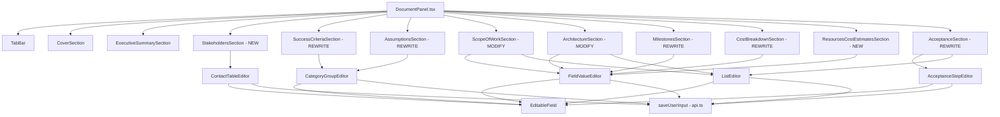
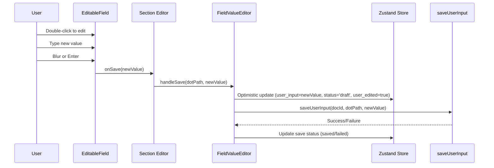

# Design Document: Frontend V2 Direct Edit

## Overview

This design aligns the frontend DocumentPanel (right-side Live Document editor) with the backend DocumentState v2 schema. The migration touches three layers:

1. **Type model** — Narrow `documentStore.ts` interfaces to match the v2 Pydantic models exactly (3-status FieldValue, no `staffing_plan`, no `client_signatures`, `bullets` not `items`, single `ScopeTask.details`, new typed sections).
2. **Tab structure** — Rename and reorder the 10 existing tabs to 11 v2 chapter tabs, adding Stakeholders and renaming Overview → Executive Summary, Team → Resources & Cost Estimates, Scope → Scope of Work, Cost → Cost Breakdown.
3. **Section editors** — Replace GenericSection usage with structured editors backed by reusable editor components, all wired to `saveUserInput` with correct dot-paths.

The backend API contract is unchanged: `POST /documents/{docId}/user-input` accepts `{ path, value, edited_by }` where `path` is a **dot-path** (e.g. `sections.scope_of_work.tasks.0.details.user_input`). AppSync patch operations use **JSON Pointer paths** (e.g. `/sections/scope_of_work/tasks/0/details/user_input`). These two formats must never be mixed.

### Key Design Decisions

| Decision | Rationale |
|---|---|
| Keep EditableField as UI-only primitive | Separation of concerns — section editors own the save logic and path construction |
| No section-level Save buttons | Immediate save on blur/Enter matches the existing UX pattern |
| Full-array persistence for add/remove | Backend needs update to support direct array replacement (see §5.3) |
| `useSaveStatus` hook for save feedback | Lightweight per-field status without global state complexity |
| Reusable editor components in `editors/` | CategoryGroup, ContactTable, AcceptanceStep, ListEditor patterns are shared across 6+ sections |
| Remove `recalculateAll` dependency | v2 has no top-level `staffing_plan`; totals come from backend |

## Architecture

### Component Hierarchy



### Save Flow



## Components and Interfaces

### 1. Tab Mapping Table

| # | V2 Tab Name | Old Tab Name | Section Key | Component File | Data Source |
|---|---|---|---|---|---|
| 1 | Cover | Cover | `cover` | `CoverSection.tsx` (modify) | `sections.cover`, `meta` |
| 2 | Executive Summary | Overview | `executive_summary` | `ExecutiveSummarySection.tsx` (modify) | `sections.executive_summary` |
| 3 | Stakeholders | *(new)* | `stakeholders` | `StakeholdersSection.tsx` (new) | `sections.stakeholders` |
| 4 | Success Criteria | Success Criteria | `success_criteria` | `SuccessCriteriaSection.tsx` (rewrite) | `sections.success_criteria` |
| 5 | Assumptions | Assumptions | `assumptions` | `AssumptionsSection.tsx` (rewrite) | `sections.assumptions` |
| 6 | Scope of Work | Scope | `scope_of_work` | `ScopeOfWorkSection.tsx` (modify) | `sections.scope_of_work` |
| 7 | Architecture | Architecture | `architecture` | `ArchitectureSection.tsx` (modify) | `sections.architecture` |
| 8 | Milestones | Milestones | `milestones` | `MilestonesSection.tsx` (rewrite) | `sections.milestones` |
| 9 | Cost Breakdown | Cost | `cost_breakdown` | `CostBreakdownSection.tsx` (rewrite) | `sections.cost_breakdown` |
| 10 | Resources & Cost Estimates | Team | `resources_cost_estimates` | `ResourcesCostEstimatesSection.tsx` (new) | `sections.resources_cost_estimates` |
| 11 | Acceptance | Acceptance | `acceptance` | `AcceptanceSection.tsx` (rewrite) | `sections.acceptance` |

### 2. DocumentPanel.tsx Changes

```typescript
const TABS = [
  'Cover',
  'Executive Summary',
  'Stakeholders',
  'Success Criteria',
  'Assumptions',
  'Scope of Work',
  'Architecture',
  'Milestones',
  'Cost Breakdown',
  'Resources & Cost Estimates',
  'Acceptance',
] as const

type TabName = typeof TABS[number]

const TAB_COMPONENTS: Record<TabName, React.FC> = {
  'Cover': CoverSection,
  'Executive Summary': ExecutiveSummarySection,
  'Stakeholders': StakeholdersSection,
  'Success Criteria': SuccessCriteriaSection,
  'Assumptions': AssumptionsSection,
  'Scope of Work': ScopeOfWorkSection,
  'Architecture': ArchitectureSection,
  'Milestones': MilestonesSection,
  'Cost Breakdown': CostBreakdownSection,
  'Resources & Cost Estimates': ResourcesCostEstimatesSection,
  'Acceptance': AcceptanceSection,
}
```

Removed imports: `OverviewSection`, `ScopeSection`, `TeamSection`, `CostSection`.
New imports: `StakeholdersSection`, `CostBreakdownSection`, `ResourcesCostEstimatesSection`.

### 3. Frontend Type Model Changes (`documentStore.ts`)

#### 3.1 FieldValue Status Narrowing

```typescript
// BEFORE
export interface FieldValue {
  user_input: any
  ai_recommended: any
  calculated: any
  status: string          // any string
  user_edited?: boolean
  reason?: string         // legacy
}

// AFTER (v2)
export type FieldStatus = 'empty' | 'draft' | 'confirmed'

export interface FieldValue {
  user_input: any
  ai_recommended: any
  calculated: any
  status: FieldStatus
  user_edited?: boolean
  // reason removed
}
```

#### 3.2 createFieldValue Helper

```typescript
// BEFORE
export const createFieldValue = (
  aiRecommended: any = null,
  userInput: any = null,
  calculated: any = null,
  status = 'empty',
): FieldValue => ({ ... })

// AFTER (v2)
export const createFieldValue = (
  aiRecommended: any = null,
  userInput: any = null,
  calculated: any = null,
  status: FieldStatus = 'empty',
): FieldValue => ({
  user_input: userInput,
  ai_recommended: aiRecommended,
  calculated,
  status,
})
```

#### 3.3 Removed Types and Properties

| Removed | Reason |
|---|---|
| `ClientSignatureSection` interface | Merged into `ResourcesCostEstimatesSection` |
| `DocumentSections.client_signatures` | Merged into `resources_cost_estimates` |
| `DocumentState.staffing_plan` | Merged into `sections.resources_cost_estimates` |
| `StaffingRole` interface | No longer used (v2 uses `TeamMember`) |
| `RoleCategory` type | No longer used |
| `FieldValue.reason` | Removed in v2 |
| `ExecutiveSummarySection.text` | Legacy field |
| `ExecutiveSummarySection.summary` | Legacy field |
| `ArchitectureSection.description` | Replaced by `overview` |
| `ArchitectureSection.tools` | Replaced by `tools_list` |
| `ArchitectureSection` index signature | v2 uses `extra="forbid"` |
| `CostBreakdownSection.aws_service_cost` | Removed in v2 |
| `CostBreakdownSection.staffing_cost` | Removed in v2 |
| `CostBreakdownSection.document_local_summary` | Removed in v2 |
| `CostBreakdownSection` index signature | v2 uses `extra="forbid"` |
| `CategoryGroup.items` | Renamed to `bullets` |
| `ScopeTask.details` as `FieldValue[]` | Changed to single `FieldValue` |

#### 3.4 New and Modified Interfaces

```typescript
// CategoryGroup: items → bullets
export interface CategoryGroup {
  category_name: FieldValue
  bullets: FieldValue[]   // was: items: FieldValue[]
}

// ScopeTask: details is single FieldValue
export interface ScopeTask {
  task_category: FieldValue
  schedule: FieldValue
  details: FieldValue      // was: FieldValue[]
  personnel: FieldValue
}

// ExecutiveSummarySection: add v2 fields, remove legacy
export interface ExecutiveSummarySection {
  customer_intro: FieldValue
  problem_statement: FieldValue
  proposed_solution: FieldValue
  phases_overview: FieldValue[]
  current_pain_points: FieldValue[]   // NEW
  poc_objectives: FieldValue[]        // NEW
  business_case: BusinessCase
  custom_blocks: Record<string, any>[] // NEW
  // REMOVED: text, summary
}

// ArchitectureSection: strict, no index signature
export interface ArchitectureSection {
  overview: FieldValue                  // was: description
  diagram_image_s3_key: FieldValue      // was: string | null
  services: ArchitectureService[]
  tools_list: FieldValue[]              // was: tools: any
  // Kept for runtime use (not persisted):
  preview_url?: string | null
  drawio_url?: string | null
}

// CostBreakdownSection: v2 flat fields
export interface CostBreakdownRow {
  category: FieldValue
  mrr: FieldValue
  arr: FieldValue
  note: FieldValue
}

export interface CostBreakdownSection {
  calculator_url: FieldValue
  mrr: FieldValue
  arr: FieldValue
  breakdown_table: CostBreakdownRow[]
  bedrock_extra: FieldValue
  funding_calculation: Record<string, any>
  // REMOVED: aws_service_cost, staffing_cost, document_local_summary, index signature
}

// NEW: ContactEntry
export interface ContactEntry {
  name: FieldValue
  title: FieldValue
  description: FieldValue
  stakeholder_for: FieldValue
  role: FieldValue
  contact: FieldValue
}

// NEW: TeamMember
export interface TeamMember {
  role: FieldValue
  name: FieldValue
}

// NEW: Phase
export interface Phase {
  phase: FieldValue
  completion_date: FieldValue
  deliverables: FieldValue
}

// NEW: AcceptanceStep
export interface AcceptanceStep {
  heading: FieldValue
  content: FieldValue
  bullets: FieldValue[]
}

// NEW: ContributionEntry
export interface ContributionEntry {
  amount: FieldValue
  pct: FieldValue
}

// NEW: Contribution
export interface Contribution {
  customer: ContributionEntry
  partner: ContributionEntry
  aws: ContributionEntry
}

// NEW: PhaseHours
export interface PhaseHours {
  phase: FieldValue
  sa_hours: number
  eng_hours: number
  other_hours: number
  total: number
}

// NEW: TotalsRow
export interface TotalsRow {
  sa: string
  eng: string
  other: string
  total: string
}

// NEW: StakeholdersSection
export interface StakeholdersSection {
  executive_sponsors: ContactEntry[]
  stakeholders: ContactEntry[]
  project_team: ContactEntry[]
  escalation_contacts: ContactEntry[]
}

// NEW: ResourcesCostEstimatesSection
export interface ResourcesCostEstimatesSection {
  partner_technical_team: TeamMember[]
  rate_solution_architect: FieldValue
  rate_engineer: FieldValue
  rate_other: FieldValue
  phase_hours_table: PhaseHours[]
  total_hours: TotalsRow
  total_cost: TotalsRow
  contribution: Contribution
  client_signature_customer_name: FieldValue
  client_signature_person_name: FieldValue
  client_signature_designation: FieldValue
  client_signature_date: FieldValue
}

// NEW: AcceptanceSection (typed)
export interface AcceptanceSectionData {
  steps: AcceptanceStep[]
}

// NEW: MilestonesSection (typed)
export interface MilestonesSectionData {
  phases: Phase[]
}

// Updated DocumentSections — fully typed, no index signature
export interface DocumentSections {
  cover?: Record<string, any>
  executive_summary?: ExecutiveSummarySection
  stakeholders?: StakeholdersSection
  success_criteria?: SuccessCriteriaSection
  assumptions?: AssumptionsSection
  scope_of_work?: ScopeOfWorkSection
  architecture?: ArchitectureSection
  milestones?: MilestonesSectionData
  cost_breakdown?: CostBreakdownSection
  resources_cost_estimates?: ResourcesCostEstimatesSection
  acceptance?: AcceptanceSectionData
}

// Updated DocumentState — no staffing_plan
export interface DocumentState {
  document_id: string
  mode: string
  version: number
  completion_score: number
  meta: { customer: FieldValue; partner: FieldValue; date: FieldValue }
  sections: DocumentSections
  sections_en?: Partial<DocumentSections>
  blocking_issues: any[]
  warnings: any[]
}
```

#### 3.5 Store Method Changes

| Removed Method | Reason |
|---|---|
| `updateStaffingRole` | No top-level `staffing_plan` in v2 |
| `addStaffingRole` | No top-level `staffing_plan` in v2 |

The `recalculateAll` import from `staffingCalc.ts` is also removed. The `setDocument` method no longer merges `staffing_plan`. The `INITIAL_STATE` no longer includes `staffing_plan`.

#### 3.6 INITIAL_STATE Update

```typescript
const INITIAL_STATE: DocumentState = {
  document_id: '',
  mode: 'architecture_absent',
  version: 0,
  completion_score: 0,
  meta: {
    customer: emptyField(),
    partner: emptyField(),
    date: emptyField(),
  },
  sections: {},
  blocking_issues: [],
  warnings: [],
}
```

### 4. Reusable Editor Components (`front/src/components/editors/`)

#### 4.1 FieldValueEditor

Shared save helper that wraps EditableField with the optimistic-update + saveUserInput pattern. This is the core building block — section editors compose it rather than calling saveUserInput directly.

```typescript
// front/src/components/editors/FieldValueEditor.tsx

interface FieldValueEditorProps {
  field: FieldValue | undefined | null
  dotPath: string              // e.g. "sections.architecture.overview.user_input"
  docId: string
  placeholder?: string
  multiline?: boolean
  type?: 'text' | 'date'
  onLocalUpdate: (newField: FieldValue) => void  // optimistic Zustand update
}

export function FieldValueEditor({
  field, dotPath, docId, placeholder, multiline, type, onLocalUpdate,
}: FieldValueEditorProps) {
  const { saveStatus, doSave } = useSaveStatus()

  const handleSave = (newValue: string) => {
    // 1. Optimistic update — must set user_edited: true
    onLocalUpdate({
      user_input: newValue,
      ai_recommended: field?.ai_recommended ?? null,
      calculated: field?.calculated ?? null,
      status: 'draft',
      user_edited: true,
    })
    // 2. Persist via API (dot-path)
    doSave(() => saveUserInput(docId, dotPath, newValue))
  }

  return (
    <div style={{ position: 'relative' }}>
      <EditableField
        value={resolveFieldValue(field) ?? ''}
        isAi={isAiRecommended(field)}
        onSave={handleSave}
        placeholder={placeholder}
        multiline={multiline}
        type={type}
      />
      <SaveStatusIndicator status={saveStatus} />
    </div>
  )
}
```

#### 4.2 CategoryGroupEditor

Used by Success Criteria and Assumptions sections.

```typescript
// front/src/components/editors/CategoryGroupEditor.tsx

interface CategoryGroupEditorProps {
  groups: CategoryGroup[]
  sectionDotPath: string       // e.g. "sections.success_criteria.groups"
  docId: string
  onGroupsChange: (groups: CategoryGroup[]) => void  // Zustand updater
}

export function CategoryGroupEditor({
  groups, sectionDotPath, docId, onGroupsChange,
}: CategoryGroupEditorProps) {
  // Edit category_name:
  //   dotPath = "{sectionDotPath}.{groupIndex}.category_name.user_input"
  // Edit bullet:
  //   dotPath = "{sectionDotPath}.{groupIndex}.bullets.{bulletIndex}.user_input"
  // Add bullet: update local array, persist full groups array to sectionDotPath
  // Add group: append new CategoryGroup with empty defaults, persist full array
  // Remove group/bullet: splice local array, persist full array
}
```

#### 4.3 ContactTableEditor

Used by Stakeholders section for each of the four contact lists.

```typescript
// front/src/components/editors/ContactTableEditor.tsx

interface ContactTableEditorProps {
  contacts: ContactEntry[]
  listDotPath: string          // e.g. "sections.stakeholders.executive_sponsors"
  docId: string
  onContactsChange: (contacts: ContactEntry[]) => void
  columns?: (keyof ContactEntry)[]  // which columns to show (varies by list type)
}

export function ContactTableEditor({
  contacts, listDotPath, docId, onContactsChange, columns,
}: ContactTableEditorProps) {
  // Edit field:
  //   dotPath = "{listDotPath}.{index}.{field}.user_input"
  // Add row: append new ContactEntry with all-empty FieldValues, persist full array
  // Remove row: splice, persist full array to listDotPath
}
```

#### 4.4 AcceptanceStepEditor

Used by Acceptance section.

```typescript
// front/src/components/editors/AcceptanceStepEditor.tsx

interface AcceptanceStepEditorProps {
  steps: AcceptanceStep[]
  sectionDotPath: string       // "sections.acceptance.steps"
  docId: string
  onStepsChange: (steps: AcceptanceStep[]) => void
}

export function AcceptanceStepEditor({
  steps, sectionDotPath, docId, onStepsChange,
}: AcceptanceStepEditorProps) {
  // Edit heading:
  //   dotPath = "{sectionDotPath}.{index}.heading.user_input"
  // Edit content:
  //   dotPath = "{sectionDotPath}.{index}.content.user_input"
  // Edit bullet:
  //   dotPath = "{sectionDotPath}.{index}.bullets.{bulletIndex}.user_input"
  // Add step: append new AcceptanceStep with empty defaults, persist full array
  // Add bullet: append empty FieldValue to step.bullets, persist full array
  // Remove step/bullet: splice, persist full array
}
```

#### 4.5 ListEditor

Generic editor for `FieldValue[]` lists (tools_list, out_of_scope, items, phases_overview, etc.).

```typescript
// front/src/components/editors/ListEditor.tsx

interface ListEditorProps {
  items: FieldValue[]
  listDotPath: string          // e.g. "sections.architecture.tools_list"
  docId: string
  onItemsChange: (items: FieldValue[]) => void
  placeholder?: string
  multiline?: boolean
}

export function ListEditor({
  items, listDotPath, docId, onItemsChange, placeholder, multiline,
}: ListEditorProps) {
  // Edit item:
  //   dotPath = "{listDotPath}.{index}.user_input"
  // Add item: append empty FieldValue, persist full array to listDotPath
  // Remove item: splice, persist full array to listDotPath
}
```

### 5. Save Flow Design

#### 5.1 Path Format Reference

**CRITICAL**: `saveUserInput` always uses **dot-paths**. AppSync patches always use **JSON Pointer paths**. Never mix them.

| Operation | saveUserInput dot-path | AppSync JSON Patch path |
|---|---|---|
| Edit executive summary field | `sections.executive_summary.customer_intro.user_input` | `/sections/executive_summary/customer_intro/user_input` |
| Edit stakeholder contact | `sections.stakeholders.executive_sponsors.0.name.user_input` | `/sections/stakeholders/executive_sponsors/0/name/user_input` |
| Edit success criteria bullet | `sections.success_criteria.groups.0.bullets.1.user_input` | `/sections/success_criteria/groups/0/bullets/1/user_input` |
| Edit category name | `sections.success_criteria.groups.0.category_name.user_input` | `/sections/success_criteria/groups/0/category_name/user_input` |
| Edit scope task details | `sections.scope_of_work.tasks.0.details.user_input` | `/sections/scope_of_work/tasks/0/details/user_input` |
| Edit architecture overview | `sections.architecture.overview.user_input` | `/sections/architecture/overview/user_input` |
| Edit architecture service | `sections.architecture.services.0.description.user_input` | `/sections/architecture/services/0/description/user_input` |
| Edit milestone phase | `sections.milestones.phases.0.phase.user_input` | `/sections/milestones/phases/0/phase/user_input` |
| Edit cost breakdown field | `sections.cost_breakdown.calculator_url.user_input` | `/sections/cost_breakdown/calculator_url/user_input` |
| Edit cost breakdown row | `sections.cost_breakdown.breakdown_table.0.category.user_input` | `/sections/cost_breakdown/breakdown_table/0/category/user_input` |
| Edit resource rate | `sections.resources_cost_estimates.rate_solution_architect.user_input` | `/sections/resources_cost_estimates/rate_solution_architect/user_input` |
| Edit team member | `sections.resources_cost_estimates.partner_technical_team.0.role.user_input` | `/sections/resources_cost_estimates/partner_technical_team/0/role/user_input` |
| Edit contribution | `sections.resources_cost_estimates.contribution.customer.amount.user_input` | `/sections/resources_cost_estimates/contribution/customer/amount/user_input` |
| Edit client signature | `sections.resources_cost_estimates.client_signature_customer_name.user_input` | `/sections/resources_cost_estimates/client_signature_customer_name/user_input` |
| Edit acceptance step | `sections.acceptance.steps.0.heading.user_input` | `/sections/acceptance/steps/0/heading/user_input` |
| Edit acceptance bullet | `sections.acceptance.steps.0.bullets.1.user_input` | `/sections/acceptance/steps/0/bullets/1/user_input` |

#### 5.2 Array Add/Remove Parent Paths

When adding or removing rows, the **full array** is persisted to the parent dot-path:

| Array | Parent dot-path for add/remove |
|---|---|
| Stakeholder contacts | `sections.stakeholders.executive_sponsors` (or `stakeholders`, `project_team`, `escalation_contacts`) |
| Success criteria groups | `sections.success_criteria.groups` |
| Assumptions groups | `sections.assumptions.groups` |
| Scope tasks | `sections.scope_of_work.tasks` |
| Out of scope items | `sections.scope_of_work.out_of_scope` |
| Scope items | `sections.scope_of_work.items` |
| Architecture services | `sections.architecture.services` |
| Architecture tools | `sections.architecture.tools_list` |
| Milestone phases | `sections.milestones.phases` |
| Cost breakdown rows | `sections.cost_breakdown.breakdown_table` |
| Team members | `sections.resources_cost_estimates.partner_technical_team` |
| Phase hours | `sections.resources_cost_estimates.phase_hours_table` |
| Acceptance steps | `sections.acceptance.steps` |

#### 5.3 Backend User-Input API: Required Changes

**⚠️ IMPORTANT**: The current backend `_handle_user_input` handler in `handler.py` has two issues that must be fixed before frontend implementation:

**Issue 1: Legacy status value.** `_field_value_with_user_input` sets `status = "user_modified"` for scalar user edits. This must be changed to `status = "draft"` to match the v2 FieldStatus enum (`empty | draft | confirmed`).

**Issue 2: No array/object replacement support.** `_handle_user_input` always calls `_set_user_input_field`, which wraps the value in a FieldValue. Sending `saveUserInput(docId, "sections.success_criteria.groups", fullArray)` would wrap the array in `{user_input: [...], status: "draft"}` — not the intended behavior.

**Resolution (Task 1 prerequisite)**:

1. **Fix `_field_value_with_user_input`**: Change `field["status"] = "user_modified"` to `field["status"] = "draft"`.

2. **Add direct replacement for array/object values**: In `_handle_user_input`, before calling `_set_user_input_field`, check if the path does NOT end with `.user_input` and the value is a `list` or `dict`. In that case:
   - Parse the path using `_path_parts(path)` (which handles both dot-paths and slash-paths)
   - Walk the nested dict using those path parts to find the parent
   - Set the value directly at the target key
   - Produce a JSON Pointer patch path like `"/sections/success_criteria/groups"` using `"/" + "/".join(parts)`
   - Do NOT call `_set_user_input_field` or `_field_value_with_user_input` for this case

**Important**: Do NOT call `_set_nested(doc_dict, raw_dot_path, value)` directly — `_set_nested` uses `/`-separated paths internally. Always use `_path_parts(path)` to parse the dot-path into segments first, then walk the dict manually.

#### 5.4 Optimistic Update Pattern

Every field edit follows this sequence:

1. **Local update**: Set `user_input` to new value, `status` to `'draft'`, `user_edited` to `true` in Zustand store.
2. **API call**: `saveUserInput(docId, dotPath, newValue)` — fire-and-forget with error tracking.
3. **Status feedback**: `useSaveStatus` hook tracks `idle → saving → saved | failed`.

For array add/remove:

1. **Local update**: Modify the array in Zustand (push/splice).
2. **API call**: `saveUserInput(docId, parentDotPath, serializedArray)` — send the full array.
3. **New rows**: Created with `createFieldValue()` defaults (all null, status `'empty'`).

### 6. Save Status Handling

#### 6.1 useSaveStatus Hook

```typescript
// front/src/hooks/useSaveStatus.ts

type SaveStatus = 'idle' | 'saving' | 'saved' | 'failed'

export function useSaveStatus(resetDelay = 2000) {
  const [saveStatus, setSaveStatus] = useState<SaveStatus>('idle')

  const doSave = useCallback(async (saveFn: () => Promise<void>) => {
    setSaveStatus('saving')
    try {
      await saveFn()
      setSaveStatus('saved')
      setTimeout(() => setSaveStatus('idle'), resetDelay)
    } catch {
      setSaveStatus('failed')
      // Do NOT reset to idle on failure — user must see the error
    }
  }, [resetDelay])

  return { saveStatus, doSave }
}
```

#### 6.2 SaveStatusIndicator Component

```typescript
// front/src/components/SaveStatusIndicator.tsx

export function SaveStatusIndicator({ status }: { status: SaveStatus }) {
  if (status === 'idle') return null
  return (
    <span style={{
      fontSize: 11,
      color: status === 'saving' ? color.textMuted
           : status === 'saved' ? color.success
           : color.error,
    }}>
      {status === 'saving' ? '저장 중...' : status === 'saved' ? '✓ 저장됨' : '✗ 저장 실패'}
    </span>
  )
}
```

For MVP, save status is tracked per `FieldValueEditor` instance (each field has its own `useSaveStatus`). This avoids global state complexity while giving immediate feedback.

### 7. Section Editor Details

#### 7.1 ExecutiveSummarySection (modify)

Changes from current:
- Add `current_pain_points: FieldValue[]` and `poc_objectives: FieldValue[]` using `ListEditor`.
- Remove references to legacy `text` and `summary` fields.
- Replace manual `saveUserInput` calls with `FieldValueEditor` for scalar fields.
- Replace manual `phases_overview` handling with `ListEditor`.
- Use `createFieldValue(null, newValue, null, 'draft')` instead of `createFieldValue(newValue, null, null, 'user_modified')`.

#### 7.2 StakeholdersSection (new)

Renders four `ContactTableEditor` instances:

```typescript
export function StakeholdersSection() {
  // Read from sections.stakeholders
  // Render 4 ContactTableEditor instances:
  //   executive_sponsors → columns: [name, title, description]
  //   stakeholders       → columns: [name, title, stakeholder_for]
  //   project_team       → columns: [name, title, role, contact]
  //   escalation_contacts → columns: [name, title, role, contact]
}
```

#### 7.3 SuccessCriteriaSection (rewrite)

Replace GenericSection wrapper with `CategoryGroupEditor`:

```typescript
export function SuccessCriteriaSection() {
  const sectionData = useDocumentStore(s => s.sections?.success_criteria)
  // Render CategoryGroupEditor with:
  //   groups = sectionData.groups
  //   sectionDotPath = "sections.success_criteria.groups"
}
```

#### 7.4 AssumptionsSection (rewrite)

Same pattern as SuccessCriteriaSection but with `sectionDotPath = "sections.assumptions.groups"`.

#### 7.5 ScopeOfWorkSection (modify)

Changes from current:
- `ScopeTask.details` is now a single `FieldValue`, not `FieldValue[]`. Remove `.split('\n')` / `.map()` logic.
- Add `out_of_scope` list using `ListEditor` with `listDotPath = "sections.scope_of_work.out_of_scope"`.
- Add `items` list using `ListEditor` with `listDotPath = "sections.scope_of_work.items"`.
- Use `createFieldValue(null, null, null, 'empty')` for new task defaults (not `'user_modified'`).
- `createTask()` returns `details: createFieldValue()` (single FieldValue, not array).

#### 7.6 ArchitectureSection (modify)

Changes from current:
- Add `FieldValueEditor` for `overview` field (currently read-only display).
- Add inline editing for each service's `service_name`, `description`, `sizing_rationale`, `priority`, `category`, `is_required_for_funding`.
- Add add/remove for services array.
- Add `ListEditor` for `tools_list`.
- Keep existing drawio upload/preview functionality.
- Remove fallback rendering of arbitrary key-value pairs.

#### 7.7 MilestonesSection (rewrite)

Replace hardcoded PHASES + staffing_plan.roles with dynamic `sections.milestones.phases[]`:

```typescript
export function MilestonesSection() {
  const phases = useDocumentStore(s => s.sections?.milestones?.phases ?? [])
  // Render table of Phase entries with FieldValueEditor for each field
  // Add/remove Phase rows
  // NO reference to staffing_plan or PHASES constant
}
```

#### 7.8 CostBreakdownSection (rewrite, renamed from CostSection)

Replace staffing_plan-based cost display with v2 fields:

```typescript
export function CostBreakdownSection() {
  const costData = useDocumentStore(s => s.sections?.cost_breakdown)
  // FieldValueEditor for: calculator_url, mrr, arr, bedrock_extra
  // Table of CostBreakdownRow with add/remove
  // Read-only display of funding_calculation
  // NO reference to staffing_plan, aws_service_cost, staffing_cost, document_local_summary
}
```

#### 7.9 ResourcesCostEstimatesSection (new)

```typescript
export function ResourcesCostEstimatesSection() {
  const rce = useDocumentStore(s => s.sections?.resources_cost_estimates)
  // partner_technical_team: table of TeamMember with add/remove
  // rate fields: FieldValueEditor for rate_solution_architect, rate_engineer, rate_other
  // phase_hours_table: table of PhaseHours (phase is FieldValue, hours are numbers)
  // total_hours, total_cost: read-only TotalsRow display
  // contribution: 6 FieldValueEditors (customer/partner/aws × amount/pct)
  // client signatures: 4 FieldValueEditors
  // NO reference to staffing_plan
}
```

#### 7.10 AcceptanceSection (rewrite)

Replace GenericSection wrapper with `AcceptanceStepEditor`:

```typescript
export function AcceptanceSection() {
  const steps = useDocumentStore(s => s.sections?.acceptance?.steps ?? [])
  // Render AcceptanceStepEditor with:
  //   steps = steps
  //   sectionDotPath = "sections.acceptance.steps"
}
```

### 8. Migration Plan — File Changes

#### 8.1 Files to Delete

| File | Reason |
|---|---|
| `front/src/components/sections/OverviewSection.tsx` | Re-export wrapper, replaced by direct import of ExecutiveSummarySection |
| `front/src/components/sections/ScopeSection.tsx` | Re-export wrapper, replaced by direct import of ScopeOfWorkSection |
| `front/src/components/sections/TeamSection.tsx` | Replaced by ResourcesCostEstimatesSection |
| `front/src/components/sections/CostSection.tsx` | Replaced by CostBreakdownSection |
| `front/src/components/sections/GenericSection.tsx` | No remaining consumers after migration |
| `front/src/utils/staffingCalc.ts` | No top-level staffing_plan in v2 |

#### 8.2 Files to Create

| File | Purpose |
|---|---|
| `front/src/components/sections/StakeholdersSection.tsx` | New Stakeholders tab editor |
| `front/src/components/sections/CostBreakdownSection.tsx` | New Cost Breakdown tab editor (replaces CostSection) |
| `front/src/components/sections/ResourcesCostEstimatesSection.tsx` | New Resources & Cost Estimates tab editor (replaces TeamSection) |
| `front/src/components/editors/FieldValueEditor.tsx` | Shared save helper wrapping EditableField |
| `front/src/components/editors/CategoryGroupEditor.tsx` | Reusable CategoryGroup editor |
| `front/src/components/editors/ContactTableEditor.tsx` | Reusable contact table editor |
| `front/src/components/editors/AcceptanceStepEditor.tsx` | Reusable AcceptanceStep editor |
| `front/src/components/editors/ListEditor.tsx` | Reusable FieldValue[] list editor |
| `front/src/components/SaveStatusIndicator.tsx` | Save status display component |
| `front/src/hooks/useSaveStatus.ts` | Save status tracking hook |

#### 8.3 Files to Heavily Modify

| File | Changes |
|---|---|
| `front/src/store/documentStore.ts` | All type changes (§3), remove staffing_plan, remove updateStaffingRole/addStaffingRole, remove recalculateAll import, update INITIAL_STATE |
| `front/src/components/DocumentPanel.tsx` | New TABS array, new TAB_COMPONENTS mapping, remove legacy imports |
| `front/src/utils/frontendSchema.ts` | Remove staffing-related helpers (createRoleDraft, buildStaffingEditPath, sortStaffingRoles, getRoleOptions, ROLE_POOL), keep architecture/formatting helpers |
| `front/src/components/sections/ExecutiveSummarySection.tsx` | Add v2 fields, use FieldValueEditor, remove legacy field references |
| `front/src/components/sections/ScopeOfWorkSection.tsx` | Single FieldValue details, add out_of_scope/items lists, use v2 status values |
| `front/src/components/sections/ArchitectureSection.tsx` | Add inline editing for overview/services/tools_list, keep drawio upload |
| `front/src/components/sections/SuccessCriteriaSection.tsx` | Replace GenericSection with CategoryGroupEditor |
| `front/src/components/sections/AssumptionsSection.tsx` | Replace GenericSection with CategoryGroupEditor |
| `front/src/components/sections/MilestonesSection.tsx` | Replace PHASES constant + staffing_plan with dynamic phases[] |
| `front/src/components/sections/AcceptanceSection.tsx` | Replace GenericSection with AcceptanceStepEditor |

## Data Models

### Backend v2 Schema (source of truth)

The backend Pydantic models in `agent/lib/schema/document_state.py` define the canonical schema. The frontend TypeScript interfaces in `documentStore.ts` must mirror these exactly. Key mappings:

| Backend (Python) | Frontend (TypeScript) | Notes |
|---|---|---|
| `FieldValue` | `FieldValue` | status: `FieldStatus` enum → `'empty' \| 'draft' \| 'confirmed'` |
| `ContactEntry` | `ContactEntry` | 6 FieldValue fields |
| `TeamMember` | `TeamMember` | role + name |
| `Phase` | `Phase` | phase + completion_date + deliverables |
| `CategoryGroup` | `CategoryGroup` | category_name + bullets (not items) |
| `ScopeTask` | `ScopeTask` | details is single FieldValue |
| `ArchitectureService` | `ArchitectureService` | service_name, priority, category, description, sizing_rationale, is_required_for_funding |
| `AcceptanceStep` | `AcceptanceStep` | heading + content + bullets |
| `CostBreakdownRow` | `CostBreakdownRow` | category + mrr + arr + note |
| `ContributionEntry` | `ContributionEntry` | amount + pct |
| `Contribution` | `Contribution` | customer + partner + aws |
| `PhaseHours` | `PhaseHours` | phase (FieldValue) + sa_hours/eng_hours/other_hours/total (numbers) |
| `TotalsRow` | `TotalsRow` | sa/eng/other/total (strings) |
| `Sections` | `DocumentSections` | All 11 section types |
| `DocumentState` | `DocumentState` | No staffing_plan |

### Empty FieldValue Factory

All new rows use this factory to create v2-compliant empty FieldValues:

```typescript
const emptyField = (): FieldValue => ({
  user_input: null,
  ai_recommended: null,
  calculated: null,
  status: 'empty',
  user_edited: false,
})
```

### New Row Factories

```typescript
function createEmptyContactEntry(): ContactEntry {
  return {
    name: emptyField(), title: emptyField(), description: emptyField(),
    stakeholder_for: emptyField(), role: emptyField(), contact: emptyField(),
  }
}

function createEmptyPhase(): Phase {
  return { phase: emptyField(), completion_date: emptyField(), deliverables: emptyField() }
}

function createEmptyScopeTask(): ScopeTask {
  return {
    task_category: emptyField(), schedule: emptyField(),
    details: emptyField(), personnel: emptyField(),
  }
}

function createEmptyCostBreakdownRow(): CostBreakdownRow {
  return { category: emptyField(), mrr: emptyField(), arr: emptyField(), note: emptyField() }
}

function createEmptyAcceptanceStep(): AcceptanceStep {
  return { heading: emptyField(), content: emptyField(), bullets: [] }
}

function createEmptyTeamMember(): TeamMember {
  return { role: emptyField(), name: emptyField() }
}

function createEmptyCategoryGroup(): CategoryGroup {
  return { category_name: emptyField(), bullets: [] }
}
```

## Design Invariants

The following invariants must hold across the implementation. They are verified by TypeScript compilation and manual review (no PBT framework in this project).

1. **Optimistic Update Invariant**: For any field edit, the optimistic Zustand store update must produce a FieldValue where `user_input` equals the provided value, `status` equals `'draft'`, and `user_edited` equals `true`.

2. **Save Path Construction**: All dot-paths passed to `saveUserInput` must follow the pattern `sections.{sectionKey}.{nestedPath}.user_input` with dot-separated segments and numeric indices for array elements. They must never contain forward slashes.

3. **New Row Schema Conformance**: Newly created rows must contain all required fields as defined by the backend Pydantic model, each initialized as a FieldValue with `user_input: null`, `ai_recommended: null`, `calculated: null`, `status: 'empty'`.

## Error Handling

### Save Errors

- **Network failure**: `saveUserInput` rejects → `useSaveStatus` sets status to `'failed'` → `SaveStatusIndicator` shows "✗ 저장 실패" in red.
- **No silent swallowing**: Current code uses `.catch(() => {})` which silently ignores errors. The v2 design replaces this with `useSaveStatus` tracking so errors are always visible.
- **No retry for MVP**: Failed saves show the error state. The user can re-edit the field to trigger a new save attempt. Automatic retry can be added later.
- **Optimistic rollback**: Not implemented for MVP. The local state keeps the user's edit even if the save fails. The error indicator tells the user the save didn't persist.

### Missing Data

- Each section editor checks for empty/undefined section data and renders an empty-state message with a chat hint (existing pattern preserved).
- `resolveFieldValue` returns `null` for undefined fields — `FieldValueEditor` displays the placeholder.

### Type Safety

- Removing index signatures from `ArchitectureSection`, `CostBreakdownSection`, and `DocumentSections` means TypeScript will catch any access to removed fields at compile time.
- The narrowed `FieldStatus` type prevents accidental use of legacy status values like `'user_modified'` or `'recommended'`.

## Testing Strategy

### Approach

The current frontend project (`front/package.json`) does not include vitest, fast-check, jest, or any test runner. The `scripts` section only has `dev`, `build`, and `preview`. **No new test dependencies are added for this MVP.**

### Validation Method

All validation is local, using the existing build toolchain:

1. **TypeScript + Vite build**: `npm run build` (runs `tsc -b && vite build`) — catches type mismatches, removed field access, wrong status values, import errors, and build failures.
2. **Optional**: `npx tsc -b --noEmit` for type-check-only passes during development (compatible with the existing `tsconfig.json`).

### Forbidden

- No Terraform apply, CDK deploy, Lambda invoke, S3 upload
- No live Bedrock, AgentCore, Gateway, or AppSync calls
- No broad E2E tests
- No new test framework dependencies (vitest, jest, fast-check, testing-library, etc.)

### Manual Verification Checklist

After implementation, verify by running `npm run build` in `front/` and confirming:
- Zero TypeScript compilation errors
- Zero Vite build errors
- No references to removed types (`StaffingRole`, `ClientSignatureSection`, `staffing_plan`, `CategoryGroup.items`, etc.)
- No references to removed components (`OverviewSection`, `ScopeSection`, `TeamSection`, `GenericSection`, `CostSection`)
- No legacy status values (`'user_modified'`, `'recommended'`, `'calculated'`) in new code
